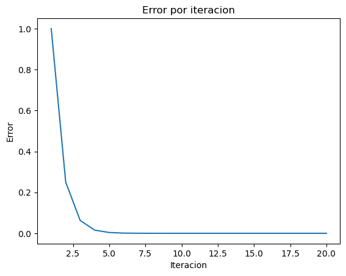

```python
import pandas as pd
import matplotlib.pyplot as plt
```


```python
def funcion_ejemplo(x):
    return (x**10) - 3
```


```python
results = []

```


```python
def biseccion(f, a: float, b: float, tol=0.01, max_iter=100):
 # f es la funcion utilizada
 # a y b son los límites iniciales del intervalo.

  x_lower = a;
  x_upper = b;

  if f(b) * f(a) > 0:
    raise ValueError("No existe raíz en el intervalo dado")

  for i in range(max_iter):
    x_result = (x_lower + x_upper)/2;
    error = (x_upper - x_lower)/2**(i+2) # Cota de error, ecuación sacada de internet y adaptada al algoritmo
    f_lower = f(x_lower)
    f_result = f(x_result)
    f_upper = f(x_upper)
    f_mult = f_lower * f_result

    results.append([i+1, x_lower, x_result, x_upper, f_lower, f_result, f_upper, f_mult, error])

    if abs(f(x_result)) <= tol:
        return x_result, i, tol

    if f_mult < 0:
        x_upper = x_result
    else:
        x_lower = x_result
  raise Exception("El número máximo de iteraciones permitidas fue excedido")


```


```python
biseccion(funcion_ejemplo,0, 4, 0.0001,100)
```


    (1.1161231994628906, 19, 0.0001)


```python
df = pd.DataFrame(data=results, columns=["Iteracion", "x_lower", "x_r", "x_upper", "f(x_l)", "f(x_r)", "f(x_u)", "f(x_l)*f(x_r)", "Error"])
df
```


<div>
<style scoped>
    .dataframe tbody tr th:only-of-type {
        vertical-align: middle;
    }

    .dataframe tbody tr th {
        vertical-align: top;
    }

    .dataframe thead th {
        text-align: right;
    }
</style>
<table border="1" class="dataframe">
  <thead>
    <tr style="text-align: right;">
      <th></th>
      <th>Iteracion</th>
      <th>x_lower</th>
      <th>x_r</th>
      <th>x_upper</th>
      <th>f(x_l)</th>
      <th>f(x_r)</th>
      <th>f(x_u)</th>
      <th>f(x_l)*f(x_r)</th>
      <th>Error</th>
    </tr>
  </thead>
  <tbody>
    <tr>
      <th>0</th>
      <td>1</td>
      <td>0.000000</td>
      <td>2.000000</td>
      <td>4.000000</td>
      <td>-3.000000</td>
      <td>1.021000e+03</td>
      <td>1.048573e+06</td>
      <td>-3.063000e+03</td>
      <td>1.000000e+00</td>
    </tr>
    <tr>
      <th>1</th>
      <td>2</td>
      <td>0.000000</td>
      <td>1.000000</td>
      <td>2.000000</td>
      <td>-3.000000</td>
      <td>-2.000000e+00</td>
      <td>1.021000e+03</td>
      <td>6.000000e+00</td>
      <td>2.500000e-01</td>
    </tr>
    <tr>
      <th>2</th>
      <td>3</td>
      <td>1.000000</td>
      <td>1.500000</td>
      <td>2.000000</td>
      <td>-2.000000</td>
      <td>5.466504e+01</td>
      <td>1.021000e+03</td>
      <td>-1.093301e+02</td>
      <td>6.250000e-02</td>
    </tr>
    <tr>
      <th>3</th>
      <td>4</td>
      <td>1.000000</td>
      <td>1.250000</td>
      <td>1.500000</td>
      <td>-2.000000</td>
      <td>6.313226e+00</td>
      <td>5.466504e+01</td>
      <td>-1.262645e+01</td>
      <td>1.562500e-02</td>
    </tr>
    <tr>
      <th>4</th>
      <td>5</td>
      <td>1.000000</td>
      <td>1.125000</td>
      <td>1.250000</td>
      <td>-2.000000</td>
      <td>2.473210e-01</td>
      <td>6.313226e+00</td>
      <td>-4.946421e-01</td>
      <td>3.906250e-03</td>
    </tr>
    <tr>
      <th>5</th>
      <td>6</td>
      <td>1.000000</td>
      <td>1.062500</td>
      <td>1.125000</td>
      <td>-2.000000</td>
      <td>-1.166464e+00</td>
      <td>2.473210e-01</td>
      <td>2.332928e+00</td>
      <td>9.765625e-04</td>
    </tr>
    <tr>
      <th>6</th>
      <td>7</td>
      <td>1.062500</td>
      <td>1.093750</td>
      <td>1.125000</td>
      <td>-1.166464</td>
      <td>-5.499178e-01</td>
      <td>2.473210e-01</td>
      <td>6.414594e-01</td>
      <td>2.441406e-04</td>
    </tr>
    <tr>
      <th>7</th>
      <td>8</td>
      <td>1.093750</td>
      <td>1.109375</td>
      <td>1.125000</td>
      <td>-0.549918</td>
      <td>-1.765263e-01</td>
      <td>2.473210e-01</td>
      <td>9.707495e-02</td>
      <td>6.103516e-05</td>
    </tr>
    <tr>
      <th>8</th>
      <td>9</td>
      <td>1.109375</td>
      <td>1.117188</td>
      <td>1.125000</td>
      <td>-0.176526</td>
      <td>2.873083e-02</td>
      <td>2.473210e-01</td>
      <td>-5.071747e-03</td>
      <td>1.525879e-05</td>
    </tr>
    <tr>
      <th>9</th>
      <td>10</td>
      <td>1.109375</td>
      <td>1.113281</td>
      <td>1.117188</td>
      <td>-0.176526</td>
      <td>-7.551804e-02</td>
      <td>2.873083e-02</td>
      <td>1.333092e-02</td>
      <td>3.814697e-06</td>
    </tr>
    <tr>
      <th>10</th>
      <td>11</td>
      <td>1.113281</td>
      <td>1.115234</td>
      <td>1.117188</td>
      <td>-0.075518</td>
      <td>-2.380438e-02</td>
      <td>2.873083e-02</td>
      <td>1.797660e-03</td>
      <td>9.536743e-07</td>
    </tr>
    <tr>
      <th>11</th>
      <td>12</td>
      <td>1.115234</td>
      <td>1.116211</td>
      <td>1.117188</td>
      <td>-0.023804</td>
      <td>2.359807e-03</td>
      <td>2.873083e-02</td>
      <td>-5.617376e-05</td>
      <td>2.384186e-07</td>
    </tr>
    <tr>
      <th>12</th>
      <td>13</td>
      <td>1.115234</td>
      <td>1.115723</td>
      <td>1.116211</td>
      <td>-0.023804</td>
      <td>-1.074805e-02</td>
      <td>2.359807e-03</td>
      <td>2.558507e-04</td>
      <td>5.960464e-08</td>
    </tr>
    <tr>
      <th>13</th>
      <td>14</td>
      <td>1.115723</td>
      <td>1.115967</td>
      <td>1.116211</td>
      <td>-0.010748</td>
      <td>-4.200574e-03</td>
      <td>2.359807e-03</td>
      <td>4.514799e-05</td>
      <td>1.490116e-08</td>
    </tr>
    <tr>
      <th>14</th>
      <td>15</td>
      <td>1.115967</td>
      <td>1.116089</td>
      <td>1.116211</td>
      <td>-0.004201</td>
      <td>-9.219977e-04</td>
      <td>2.359807e-03</td>
      <td>3.872920e-06</td>
      <td>3.725290e-09</td>
    </tr>
    <tr>
      <th>15</th>
      <td>16</td>
      <td>1.116089</td>
      <td>1.116150</td>
      <td>1.116211</td>
      <td>-0.000922</td>
      <td>7.185011e-04</td>
      <td>2.359807e-03</td>
      <td>-6.624564e-07</td>
      <td>9.313226e-10</td>
    </tr>
    <tr>
      <th>16</th>
      <td>17</td>
      <td>1.116089</td>
      <td>1.116119</td>
      <td>1.116150</td>
      <td>-0.000922</td>
      <td>-1.018493e-04</td>
      <td>7.185011e-04</td>
      <td>9.390478e-08</td>
      <td>2.328306e-10</td>
    </tr>
    <tr>
      <th>17</th>
      <td>18</td>
      <td>1.116119</td>
      <td>1.116135</td>
      <td>1.116150</td>
      <td>-0.000102</td>
      <td>3.083007e-04</td>
      <td>7.185011e-04</td>
      <td>-3.140019e-08</td>
      <td>5.820766e-11</td>
    </tr>
    <tr>
      <th>18</th>
      <td>19</td>
      <td>1.116119</td>
      <td>1.116127</td>
      <td>1.116135</td>
      <td>-0.000102</td>
      <td>1.032194e-04</td>
      <td>3.083007e-04</td>
      <td>-1.051282e-08</td>
      <td>1.455192e-11</td>
    </tr>
    <tr>
      <th>19</th>
      <td>20</td>
      <td>1.116119</td>
      <td>1.116123</td>
      <td>1.116127</td>
      <td>-0.000102</td>
      <td>6.834995e-07</td>
      <td>1.032194e-04</td>
      <td>-6.961392e-11</td>
      <td>3.637979e-12</td>
    </tr>
  </tbody>
</table>
</div>


```python
# plot
fig, ax = plt.subplots()

ax.plot(df['Iteracion'], df['Error']) # 'Iteracion' en x, 'Error' en y

plt.title("Error por iteracion")
plt.xlabel("Iteracion")
plt.ylabel("Error")
plt.show()
```


    

    


```python

```
