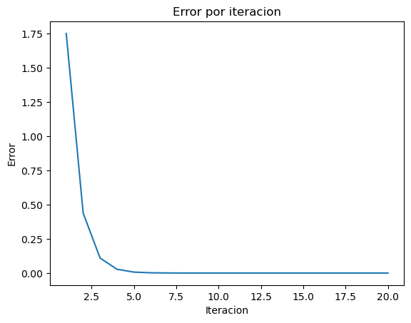

```python
import pandas as pd
import matplotlib.pyplot as plt
```


```python
def funcion_ejemplo(x):
    return (x**3) + 2*(x**2) - 4*x + 5
```


```python
results = []

```


```python
def biseccion(f, a: float, b: float, tol=0.01, max_iter=100):
 # f es la funcion utilizada
 # a y b son los límites iniciales del intervalo.

  x_lower = a;
  x_upper = b;

  if f(b) * f(a) > 0:
    raise ValueError("No existe raíz en el intervalo dado")

  for i in range(max_iter):
    x_result = (x_lower + x_upper)/2;
    error = (x_upper - x_lower)/2**(i+2) # Cota de error, ecuación sacada de internet y adaptada al algoritmo
    f_lower = f(x_lower)
    f_result = f(x_result)
    f_upper = f(x_upper)
    f_mult = f_lower * f_result

    results.append([i+1, x_lower, x_result, x_upper, f_lower, f_result, f_upper, f_mult, error])

    if abs(f(x_result)) <= tol:
        return x_result, i, tol

    if f_mult < 0:
        x_upper = x_result
    else:
        x_lower = x_result
  raise Exception("El número máximo de iteraciones permitidas fue excedido")


```


```python
biseccion(funcion_ejemplo, -5, 2, 0.0001,100)
```


    (-3.532843589782715, 19, 0.0001)


```python
df = pd.DataFrame(data=results, columns=["Iteracion", "x_lower", "x_r", "x_upper", "f(x_l)", "f(x_r)", "f(x_u)", "f(x_l)*f(x_r)", "Error"])
df
```


<div>
<style scoped>
    .dataframe tbody tr th:only-of-type {
        vertical-align: middle;
    }

    .dataframe tbody tr th {
        vertical-align: top;
    }

    .dataframe thead th {
        text-align: right;
    }
</style>
<table border="1" class="dataframe">
  <thead>
    <tr style="text-align: right;">
      <th></th>
      <th>Iteracion</th>
      <th>x_lower</th>
      <th>x_r</th>
      <th>x_upper</th>
      <th>f(x_l)</th>
      <th>f(x_r)</th>
      <th>f(x_u)</th>
      <th>f(x_l)*f(x_r)</th>
      <th>Error</th>
    </tr>
  </thead>
  <tbody>
    <tr>
      <th>0</th>
      <td>1</td>
      <td>-5.000000</td>
      <td>-1.500000</td>
      <td>2.000000</td>
      <td>-50.000000</td>
      <td>12.125000</td>
      <td>13.000000</td>
      <td>-6.062500e+02</td>
      <td>1.750000e+00</td>
    </tr>
    <tr>
      <th>1</th>
      <td>2</td>
      <td>-5.000000</td>
      <td>-3.250000</td>
      <td>-1.500000</td>
      <td>-50.000000</td>
      <td>4.796875</td>
      <td>12.125000</td>
      <td>-2.398438e+02</td>
      <td>4.375000e-01</td>
    </tr>
    <tr>
      <th>2</th>
      <td>3</td>
      <td>-5.000000</td>
      <td>-4.125000</td>
      <td>-3.250000</td>
      <td>-50.000000</td>
      <td>-14.658203</td>
      <td>4.796875</td>
      <td>7.329102e+02</td>
      <td>1.093750e-01</td>
    </tr>
    <tr>
      <th>3</th>
      <td>4</td>
      <td>-4.125000</td>
      <td>-3.687500</td>
      <td>-3.250000</td>
      <td>-14.658203</td>
      <td>-3.196045</td>
      <td>4.796875</td>
      <td>4.684828e+01</td>
      <td>2.734375e-02</td>
    </tr>
    <tr>
      <th>4</th>
      <td>5</td>
      <td>-3.687500</td>
      <td>-3.468750</td>
      <td>-3.250000</td>
      <td>-3.196045</td>
      <td>1.202667</td>
      <td>4.796875</td>
      <td>-3.843779e+00</td>
      <td>6.835938e-03</td>
    </tr>
    <tr>
      <th>5</th>
      <td>6</td>
      <td>-3.687500</td>
      <td>-3.578125</td>
      <td>-3.468750</td>
      <td>-3.196045</td>
      <td>-0.892200</td>
      <td>1.202667</td>
      <td>2.851513e+00</td>
      <td>1.708984e-03</td>
    </tr>
    <tr>
      <th>6</th>
      <td>7</td>
      <td>-3.578125</td>
      <td>-3.523438</td>
      <td>-3.468750</td>
      <td>-0.892200</td>
      <td>0.180865</td>
      <td>1.202667</td>
      <td>-1.613677e-01</td>
      <td>4.272461e-04</td>
    </tr>
    <tr>
      <th>7</th>
      <td>8</td>
      <td>-3.578125</td>
      <td>-3.550781</td>
      <td>-3.523438</td>
      <td>-0.892200</td>
      <td>-0.349199</td>
      <td>0.180865</td>
      <td>3.115552e-01</td>
      <td>1.068115e-04</td>
    </tr>
    <tr>
      <th>8</th>
      <td>9</td>
      <td>-3.550781</td>
      <td>-3.537109</td>
      <td>-3.523438</td>
      <td>-0.349199</td>
      <td>-0.082557</td>
      <td>0.180865</td>
      <td>2.882889e-02</td>
      <td>2.670288e-05</td>
    </tr>
    <tr>
      <th>9</th>
      <td>10</td>
      <td>-3.537109</td>
      <td>-3.530273</td>
      <td>-3.523438</td>
      <td>-0.082557</td>
      <td>0.049555</td>
      <td>0.180865</td>
      <td>-4.091144e-03</td>
      <td>6.675720e-06</td>
    </tr>
    <tr>
      <th>10</th>
      <td>11</td>
      <td>-3.537109</td>
      <td>-3.533691</td>
      <td>-3.530273</td>
      <td>-0.082557</td>
      <td>-0.016401</td>
      <td>0.049555</td>
      <td>1.353985e-03</td>
      <td>1.668930e-06</td>
    </tr>
    <tr>
      <th>11</th>
      <td>12</td>
      <td>-3.533691</td>
      <td>-3.531982</td>
      <td>-3.530273</td>
      <td>-0.016401</td>
      <td>0.016602</td>
      <td>0.049555</td>
      <td>-2.722891e-04</td>
      <td>4.172325e-07</td>
    </tr>
    <tr>
      <th>12</th>
      <td>13</td>
      <td>-3.533691</td>
      <td>-3.532837</td>
      <td>-3.531982</td>
      <td>-0.016401</td>
      <td>0.000107</td>
      <td>0.016602</td>
      <td>-1.758461e-06</td>
      <td>1.043081e-07</td>
    </tr>
    <tr>
      <th>13</th>
      <td>14</td>
      <td>-3.533691</td>
      <td>-3.533264</td>
      <td>-3.532837</td>
      <td>-0.016401</td>
      <td>-0.008145</td>
      <td>0.000107</td>
      <td>1.335841e-04</td>
      <td>2.607703e-08</td>
    </tr>
    <tr>
      <th>14</th>
      <td>15</td>
      <td>-3.533264</td>
      <td>-3.533051</td>
      <td>-3.532837</td>
      <td>-0.008145</td>
      <td>-0.004019</td>
      <td>0.000107</td>
      <td>3.273145e-05</td>
      <td>6.519258e-09</td>
    </tr>
    <tr>
      <th>15</th>
      <td>16</td>
      <td>-3.533051</td>
      <td>-3.532944</td>
      <td>-3.532837</td>
      <td>-0.004019</td>
      <td>-0.001956</td>
      <td>0.000107</td>
      <td>7.858529e-06</td>
      <td>1.629815e-09</td>
    </tr>
    <tr>
      <th>16</th>
      <td>17</td>
      <td>-3.532944</td>
      <td>-3.532890</td>
      <td>-3.532837</td>
      <td>-0.001956</td>
      <td>-0.000924</td>
      <td>0.000107</td>
      <td>1.807232e-06</td>
      <td>4.074536e-10</td>
    </tr>
    <tr>
      <th>17</th>
      <td>18</td>
      <td>-3.532890</td>
      <td>-3.532864</td>
      <td>-3.532837</td>
      <td>-0.000924</td>
      <td>-0.000408</td>
      <td>0.000107</td>
      <td>3.774759e-07</td>
      <td>1.018634e-10</td>
    </tr>
    <tr>
      <th>18</th>
      <td>19</td>
      <td>-3.532864</td>
      <td>-3.532850</td>
      <td>-3.532837</td>
      <td>-0.000408</td>
      <td>-0.000151</td>
      <td>0.000107</td>
      <td>6.152104e-08</td>
      <td>2.546585e-11</td>
    </tr>
    <tr>
      <th>19</th>
      <td>20</td>
      <td>-3.532850</td>
      <td>-3.532844</td>
      <td>-3.532837</td>
      <td>-0.000151</td>
      <td>-0.000022</td>
      <td>0.000107</td>
      <td>3.268204e-09</td>
      <td>6.366463e-12</td>
    </tr>
  </tbody>
</table>
</div>


```python
# plot
fig, ax = plt.subplots()

ax.plot(df['Iteracion'], df['Error']) # 'Iteracion' en x, 'Error' en y

plt.title("Error por iteracion")
plt.xlabel("Iteracion")
plt.ylabel("Error")
plt.show()
```


    

    


```python

```
