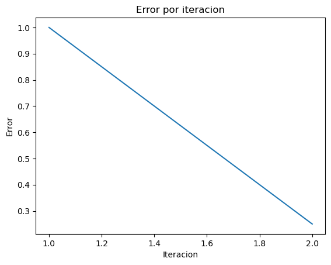

```python
import pandas as pd
import matplotlib.pyplot as plt
import math
```


```python
def funcion_ejemplo(x):
    return math.tanh((x**2) - 9)
```


```python
results = []

```


```python
def biseccion(f, a: float, b: float, tol=0.01, max_iter=100):
 # f es la funcion utilizada
 # a y b son los límites iniciales del intervalo.

  x_lower = a;
  x_upper = b;

  if f(b) * f(a) > 0:
    raise ValueError("No existe raíz en el intervalo dado")

  for i in range(max_iter):
    x_result = (x_lower + x_upper)/2;
    error = (x_upper - x_lower)/2**(i+2) # Cota de error, ecuación sacada de internet y adaptada al algoritmo
    f_lower = f(x_lower)
    f_result = f(x_result)
    f_upper = f(x_upper)
    f_mult = f_lower * f_result

    results.append([i+1, x_lower, x_result, x_upper, f_lower, f_result, f_upper, f_mult, error])

    if abs(f(x_result)) <= tol:
        return x_result, i, tol

    if f_mult < 0:
        x_upper = x_result
    else:
        x_lower = x_result
  raise Exception("El número máximo de iteraciones permitidas fue excedido")


```


```python
biseccion(funcion_ejemplo, 0, 4, 0.0001,100)
```


    (3.0, 1, 0.0001)


```python
df = pd.DataFrame(data=results, columns=["Iteracion", "x_lower", "x_r", "x_upper", "f(x_l)", "f(x_r)", "f(x_u)", "f(x_l)*f(x_r)", "Error"])
df
```


<div>
<style scoped>
    .dataframe tbody tr th:only-of-type {
        vertical-align: middle;
    }

    .dataframe tbody tr th {
        vertical-align: top;
    }

    .dataframe thead th {
        text-align: right;
    }
</style>
<table border="1" class="dataframe">
  <thead>
    <tr style="text-align: right;">
      <th></th>
      <th>Iteracion</th>
      <th>x_lower</th>
      <th>x_r</th>
      <th>x_upper</th>
      <th>f(x_l)</th>
      <th>f(x_r)</th>
      <th>f(x_u)</th>
      <th>f(x_l)*f(x_r)</th>
      <th>Error</th>
    </tr>
  </thead>
  <tbody>
    <tr>
      <th>0</th>
      <td>1</td>
      <td>0.0</td>
      <td>2.0</td>
      <td>4</td>
      <td>-1.000000</td>
      <td>-0.999909</td>
      <td>0.999998</td>
      <td>0.999909</td>
      <td>1.00</td>
    </tr>
    <tr>
      <th>1</th>
      <td>2</td>
      <td>2.0</td>
      <td>3.0</td>
      <td>4</td>
      <td>-0.999909</td>
      <td>0.000000</td>
      <td>0.999998</td>
      <td>-0.000000</td>
      <td>0.25</td>
    </tr>
  </tbody>
</table>
</div>


```python
# plot
fig, ax = plt.subplots()

ax.plot(df['Iteracion'], df['Error']) # 'Iteracion' en x, 'Error' en y

plt.title("Error por iteracion")
plt.xlabel("Iteracion")
plt.ylabel("Error")
plt.show()
```


    

    


```python

```
