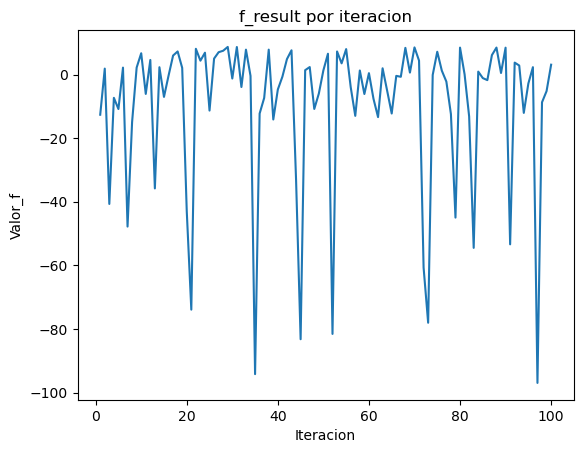
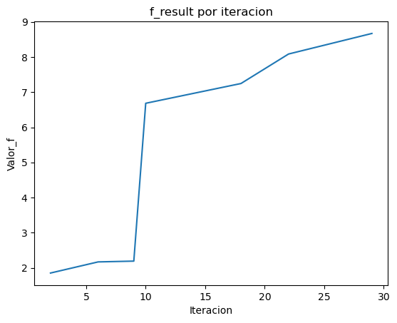

# Busqueda Aleatoria

En esta implementación completa estamos desarrollando el proceso de maximización para la función ejemplo que se da en las diapositivas. Utilizando como puntos de partida los intervalos designados en las mismas


```python
import random
import pandas as pd
import matplotlib.pyplot as plt
```


```python
def funcion_prueba(x,y):
  return -1.5*(x**6) - 2*(x**4) + 12*x
```


```python
results = []
bestF = []
```


```python
def max_busqueda_aleatoria(f, x_lower, x_upper, y_lower, y_upper, iter):

  mejorF = 0
  mejorX = -1
  mejorY = 0

  for i in range(iter):
    rand_num = random.random()
    x = x_lower + (x_upper - x_lower)*rand_num
    y = y_lower + (y_upper - y_lower)*rand_num

    f_result = f(x,y)
    results.append([i+1, x, y, f_result]) # Construye como va variando los resultados
    if f_result > mejorF:
      mejorF = f_result
      mejorX = x
      mejorY = y
      bestF.append([i+1, mejorX, mejorY, mejorF])

  return mejorX, mejorY, mejorF
```


```python
# Probamos la funcion
max_busqueda_aleatoria(funcion_prueba, -1, 2, -2, 14, 100)
```


    (0.8836865511641818, 8.046328272875636, 8.670322859573817)


Como no se conoce el verdadero máximo de la función previamente y los intervalos y calculos en general dependen de la aleatoriedad. No podemos determinar una función de error generalizada a cualquier función. Para compensar esto vamos a graficar como va evolucionando el f_máximo de la función a medida que se itera


```python
df_results = pd.DataFrame(results, columns=['iteracion', 'x', 'y', 'f'])
df_results
```


<div>
<style scoped>
    .dataframe tbody tr th:only-of-type {
        vertical-align: middle;
    }

    .dataframe tbody tr th {
        vertical-align: top;
    }

    .dataframe thead th {
        text-align: right;
    }
</style>
<table border="1" class="dataframe">
  <thead>
    <tr style="text-align: right;">
      <th></th>
      <th>iteracion</th>
      <th>x</th>
      <th>y</th>
      <th>f</th>
    </tr>
  </thead>
  <tbody>
    <tr>
      <th>0</th>
      <td>1</td>
      <td>-0.888449</td>
      <td>-1.405061</td>
      <td>-12.645219</td>
    </tr>
    <tr>
      <th>1</th>
      <td>2</td>
      <td>0.154418</td>
      <td>4.156894</td>
      <td>1.851854</td>
    </tr>
    <tr>
      <th>2</th>
      <td>3</td>
      <td>1.749146</td>
      <td>12.662112</td>
      <td>-40.689832</td>
    </tr>
    <tr>
      <th>3</th>
      <td>4</td>
      <td>-0.586006</td>
      <td>0.207968</td>
      <td>-7.328668</td>
    </tr>
    <tr>
      <th>4</th>
      <td>5</td>
      <td>-0.802149</td>
      <td>-0.944792</td>
      <td>-10.853413</td>
    </tr>
    <tr>
      <th>...</th>
      <td>...</td>
      <td>...</td>
      <td>...</td>
      <td>...</td>
    </tr>
    <tr>
      <th>95</th>
      <td>96</td>
      <td>1.308786</td>
      <td>10.313523</td>
      <td>2.298441</td>
    </tr>
    <tr>
      <th>96</th>
      <td>97</td>
      <td>1.978715</td>
      <td>13.886480</td>
      <td>-96.945471</td>
    </tr>
    <tr>
      <th>97</th>
      <td>98</td>
      <td>-0.679526</td>
      <td>-0.290808</td>
      <td>-8.728438</td>
    </tr>
    <tr>
      <th>98</th>
      <td>99</td>
      <td>-0.428857</td>
      <td>1.046096</td>
      <td>-5.223268</td>
    </tr>
    <tr>
      <th>99</th>
      <td>100</td>
      <td>0.257907</td>
      <td>4.708836</td>
      <td>3.085591</td>
    </tr>
  </tbody>
</table>
<p>100 rows × 4 columns</p>
</div>


```python
df_bestF = pd.DataFrame(bestF, columns=['iteracion', 'mejor_x', 'mejor_y', 'mejor_f'])
df_bestF
```


<div>
<style scoped>
    .dataframe tbody tr th:only-of-type {
        vertical-align: middle;
    }

    .dataframe tbody tr th {
        vertical-align: top;
    }

    .dataframe thead th {
        text-align: right;
    }
</style>
<table border="1" class="dataframe">
  <thead>
    <tr style="text-align: right;">
      <th></th>
      <th>iteracion</th>
      <th>mejor_x</th>
      <th>mejor_y</th>
      <th>mejor_f</th>
    </tr>
  </thead>
  <tbody>
    <tr>
      <th>0</th>
      <td>2</td>
      <td>0.154418</td>
      <td>4.156894</td>
      <td>1.851854</td>
    </tr>
    <tr>
      <th>1</th>
      <td>6</td>
      <td>0.180901</td>
      <td>4.298139</td>
      <td>2.168617</td>
    </tr>
    <tr>
      <th>2</th>
      <td>9</td>
      <td>0.182793</td>
      <td>4.308227</td>
      <td>2.191223</td>
    </tr>
    <tr>
      <th>3</th>
      <td>10</td>
      <td>1.157974</td>
      <td>9.509193</td>
      <td>6.683183</td>
    </tr>
    <tr>
      <th>4</th>
      <td>18</td>
      <td>0.640464</td>
      <td>6.749142</td>
      <td>7.245522</td>
    </tr>
    <tr>
      <th>5</th>
      <td>22</td>
      <td>1.058103</td>
      <td>8.976549</td>
      <td>8.085276</td>
    </tr>
    <tr>
      <th>6</th>
      <td>29</td>
      <td>0.883687</td>
      <td>8.046328</td>
      <td>8.670323</td>
    </tr>
  </tbody>
</table>
</div>


## Gráficas de ambos resultados


```python
# plot
fig, ax = plt.subplots()

ax.plot(df_results['iteracion'], df_results['f']) # 'Iteracion' en x, 'Error' en y

plt.title("f_result por iteracion")
plt.xlabel("Iteracion")
plt.ylabel("Valor_f")
plt.show()
```


    

    


Para graficar el mejor resultado obtenido se utiliza un scatterplot, ya que el algoritmo mejora sus resultados de manera aleatoria y repentina. Lo cual no se entiende del todo si se utiliza una linea que conecte los puntos.


```python
# plot
fig, ax = plt.subplots()

ax.plot(df_bestF['iteracion'], df_bestF['mejor_f']) # 'Iteracion' en x, 'Error' en y


plt.title("f_result por iteracion")
plt.xlabel("Iteracion")
plt.ylabel("Valor_f")
plt.show()
```


    

    


```python

```
