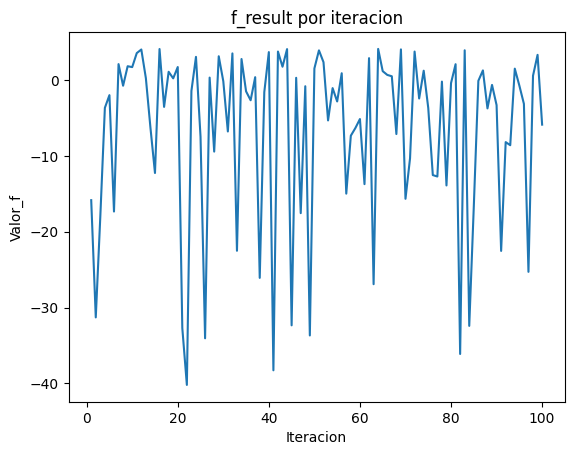
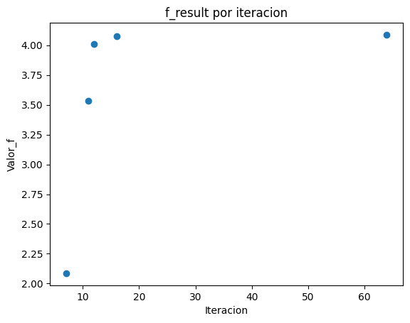

# Busqueda Aleatoria

En esta implementación completa estamos desarrollando el proceso de maximización para la función ejemplo que se da en las diapositivas. Utilizando como puntos de partida los intervalos designados en las mismas


```python
import random
import pandas as pd
import matplotlib.pyplot as plt
```


```python
def funcion_prueba(x,y):
  return 4*x + 2*y + x**2 - 2*(x**4) + 2*x*y - 3*(y**2)
```


```python
results = []
bestF = []
```


```python
def max_busqueda_aleatoria(f, x_lower, x_upper, y_lower, y_upper, iter):

  mejorF = 0
  mejorX = -1
  mejorY = 0

  for i in range(iter):
    rand_num = random.random()
    x = x_lower + (x_upper - x_lower)*rand_num
    y = y_lower + (y_upper - y_lower)*rand_num

    f_result = f(x,y)
    results.append([i+1, x, y, f_result]) # Construye como va variando los resultados
    if f_result > mejorF:
      mejorF = f_result
      mejorX = x
      mejorY = y
      bestF.append([i+1, mejorX, mejorY, mejorF])

  return mejorX, mejorY, mejorF
```


```python
# Probamos la funcion
max_busqueda_aleatoria(funcion_prueba, -2, 2, -2, 2, 100)
```


    (0.9097306424260503, 0.9097306424260503, 4.088507754170767)


Como no se conoce el verdadero máximo de la función previamente y los intervalos y calculos en general dependen de la aleatoriedad. No podemos determinar una función de error generalizada a cualquier función. Para compensar esto vamos a graficar como va evolucionando el f_máximo de la función a medida que se itera


```python
df_results = pd.DataFrame(results, columns=['iteracion', 'x', 'y', 'f'])
df_results
```


  <div id="df-48076055-8360-4b63-8070-433544e93950" class="colab-df-container">
    <div>
<style scoped>
    .dataframe tbody tr th:only-of-type {
        vertical-align: middle;
    }

    .dataframe tbody tr th {
        vertical-align: top;
    }

    .dataframe thead th {
        text-align: right;
    }
</style>
<table border="1" class="dataframe">
  <thead>
    <tr style="text-align: right;">
      <th></th>
      <th>iteracion</th>
      <th>x</th>
      <th>y</th>
      <th>f</th>
    </tr>
  </thead>
  <tbody>
    <tr>
      <th>0</th>
      <td>1</td>
      <td>-1.391538</td>
      <td>-1.391538</td>
      <td>-15.848353</td>
    </tr>
    <tr>
      <th>1</th>
      <td>2</td>
      <td>-1.790528</td>
      <td>-1.790528</td>
      <td>-31.299908</td>
    </tr>
    <tr>
      <th>2</th>
      <td>3</td>
      <td>-1.464020</td>
      <td>-1.464020</td>
      <td>-17.972069</td>
    </tr>
    <tr>
      <th>3</th>
      <td>4</td>
      <td>1.606083</td>
      <td>1.606083</td>
      <td>-3.671161</td>
    </tr>
    <tr>
      <th>4</th>
      <td>5</td>
      <td>-0.329924</td>
      <td>-0.329924</td>
      <td>-2.003241</td>
    </tr>
    <tr>
      <th>...</th>
      <td>...</td>
      <td>...</td>
      <td>...</td>
      <td>...</td>
    </tr>
    <tr>
      <th>95</th>
      <td>96</td>
      <td>-0.503509</td>
      <td>-0.503509</td>
      <td>-3.149602</td>
    </tr>
    <tr>
      <th>96</th>
      <td>97</td>
      <td>-1.663463</td>
      <td>-1.663463</td>
      <td>-25.294550</td>
    </tr>
    <tr>
      <th>97</th>
      <td>98</td>
      <td>0.092525</td>
      <td>0.092525</td>
      <td>0.555005</td>
    </tr>
    <tr>
      <th>98</th>
      <td>99</td>
      <td>1.164871</td>
      <td>1.164871</td>
      <td>3.306740</td>
    </tr>
    <tr>
      <th>99</th>
      <td>100</td>
      <td>-0.826493</td>
      <td>-0.826493</td>
      <td>-5.892180</td>
    </tr>
  </tbody>
</table>
<p>100 rows × 4 columns</p>
</div>
    <div class="colab-df-buttons">

  <div class="colab-df-container">
    <button class="colab-df-convert" onclick="convertToInteractive('df-48076055-8360-4b63-8070-433544e93950')"
            title="Convert this dataframe to an interactive table."
            style="display:none;">

  <svg xmlns="http://www.w3.org/2000/svg" height="24px" viewBox="0 -960 960 960">
    <path d="M120-120v-720h720v720H120Zm60-500h600v-160H180v160Zm220 220h160v-160H400v160Zm0 220h160v-160H400v160ZM180-400h160v-160H180v160Zm440 0h160v-160H620v160ZM180-180h160v-160H180v160Zm440 0h160v-160H620v160Z"/>
  </svg>
    </button>

  <style>
    .colab-df-container {
      display:flex;
      gap: 12px;
    }

    .colab-df-convert {
      background-color: #E8F0FE;
      border: none;
      border-radius: 50%;
      cursor: pointer;
      display: none;
      fill: #1967D2;
      height: 32px;
      padding: 0 0 0 0;
      width: 32px;
    }

    .colab-df-convert:hover {
      background-color: #E2EBFA;
      box-shadow: 0px 1px 2px rgba(60, 64, 67, 0.3), 0px 1px 3px 1px rgba(60, 64, 67, 0.15);
      fill: #174EA6;
    }

    .colab-df-buttons div {
      margin-bottom: 4px;
    }

    [theme=dark] .colab-df-convert {
      background-color: #3B4455;
      fill: #D2E3FC;
    }

    [theme=dark] .colab-df-convert:hover {
      background-color: #434B5C;
      box-shadow: 0px 1px 3px 1px rgba(0, 0, 0, 0.15);
      filter: drop-shadow(0px 1px 2px rgba(0, 0, 0, 0.3));
      fill: #FFFFFF;
    }
  </style>

    <script>
      const buttonEl =
        document.querySelector('#df-48076055-8360-4b63-8070-433544e93950 button.colab-df-convert');
      buttonEl.style.display =
        google.colab.kernel.accessAllowed ? 'block' : 'none';

      async function convertToInteractive(key) {
        const element = document.querySelector('#df-48076055-8360-4b63-8070-433544e93950');
        const dataTable =
          await google.colab.kernel.invokeFunction('convertToInteractive',
                                                    [key], {});
        if (!dataTable) return;

        const docLinkHtml = 'Like what you see? Visit the ' +
          '<a target="_blank" href=https://colab.research.google.com/notebooks/data_table.ipynb>data table notebook</a>'
          + ' to learn more about interactive tables.';
        element.innerHTML = '';
        dataTable['output_type'] = 'display_data';
        await google.colab.output.renderOutput(dataTable, element);
        const docLink = document.createElement('div');
        docLink.innerHTML = docLinkHtml;
        element.appendChild(docLink);
      }
    </script>
  </div>


<div id="df-6cd793be-bd07-45cf-ad44-dd1ed7eb9160">
  <button class="colab-df-quickchart" onclick="quickchart('df-6cd793be-bd07-45cf-ad44-dd1ed7eb9160')"
            title="Suggest charts"
            style="display:none;">

<svg xmlns="http://www.w3.org/2000/svg" height="24px"viewBox="0 0 24 24"
     width="24px">
    <g>
        <path d="M19 3H5c-1.1 0-2 .9-2 2v14c0 1.1.9 2 2 2h14c1.1 0 2-.9 2-2V5c0-1.1-.9-2-2-2zM9 17H7v-7h2v7zm4 0h-2V7h2v10zm4 0h-2v-4h2v4z"/>
    </g>
</svg>
  </button>

<style>
  .colab-df-quickchart {
      --bg-color: #E8F0FE;
      --fill-color: #1967D2;
      --hover-bg-color: #E2EBFA;
      --hover-fill-color: #174EA6;
      --disabled-fill-color: #AAA;
      --disabled-bg-color: #DDD;
  }

  [theme=dark] .colab-df-quickchart {
      --bg-color: #3B4455;
      --fill-color: #D2E3FC;
      --hover-bg-color: #434B5C;
      --hover-fill-color: #FFFFFF;
      --disabled-bg-color: #3B4455;
      --disabled-fill-color: #666;
  }

  .colab-df-quickchart {
    background-color: var(--bg-color);
    border: none;
    border-radius: 50%;
    cursor: pointer;
    display: none;
    fill: var(--fill-color);
    height: 32px;
    padding: 0;
    width: 32px;
  }

  .colab-df-quickchart:hover {
    background-color: var(--hover-bg-color);
    box-shadow: 0 1px 2px rgba(60, 64, 67, 0.3), 0 1px 3px 1px rgba(60, 64, 67, 0.15);
    fill: var(--button-hover-fill-color);
  }

  .colab-df-quickchart-complete:disabled,
  .colab-df-quickchart-complete:disabled:hover {
    background-color: var(--disabled-bg-color);
    fill: var(--disabled-fill-color);
    box-shadow: none;
  }

  .colab-df-spinner {
    border: 2px solid var(--fill-color);
    border-color: transparent;
    border-bottom-color: var(--fill-color);
    animation:
      spin 1s steps(1) infinite;
  }

  @keyframes spin {
    0% {
      border-color: transparent;
      border-bottom-color: var(--fill-color);
      border-left-color: var(--fill-color);
    }
    20% {
      border-color: transparent;
      border-left-color: var(--fill-color);
      border-top-color: var(--fill-color);
    }
    30% {
      border-color: transparent;
      border-left-color: var(--fill-color);
      border-top-color: var(--fill-color);
      border-right-color: var(--fill-color);
    }
    40% {
      border-color: transparent;
      border-right-color: var(--fill-color);
      border-top-color: var(--fill-color);
    }
    60% {
      border-color: transparent;
      border-right-color: var(--fill-color);
    }
    80% {
      border-color: transparent;
      border-right-color: var(--fill-color);
      border-bottom-color: var(--fill-color);
    }
    90% {
      border-color: transparent;
      border-bottom-color: var(--fill-color);
    }
  }
</style>

  <script>
    async function quickchart(key) {
      const quickchartButtonEl =
        document.querySelector('#' + key + ' button');
      quickchartButtonEl.disabled = true;  // To prevent multiple clicks.
      quickchartButtonEl.classList.add('colab-df-spinner');
      try {
        const charts = await google.colab.kernel.invokeFunction(
            'suggestCharts', [key], {});
      } catch (error) {
        console.error('Error during call to suggestCharts:', error);
      }
      quickchartButtonEl.classList.remove('colab-df-spinner');
      quickchartButtonEl.classList.add('colab-df-quickchart-complete');
    }
    (() => {
      let quickchartButtonEl =
        document.querySelector('#df-6cd793be-bd07-45cf-ad44-dd1ed7eb9160 button');
      quickchartButtonEl.style.display =
        google.colab.kernel.accessAllowed ? 'block' : 'none';
    })();
  </script>
</div>

  <div id="id_c3ae675c-5453-477f-b2fc-578aa2618cdb">
    <style>
      .colab-df-generate {
        background-color: #E8F0FE;
        border: none;
        border-radius: 50%;
        cursor: pointer;
        display: none;
        fill: #1967D2;
        height: 32px;
        padding: 0 0 0 0;
        width: 32px;
      }

      .colab-df-generate:hover {
        background-color: #E2EBFA;
        box-shadow: 0px 1px 2px rgba(60, 64, 67, 0.3), 0px 1px 3px 1px rgba(60, 64, 67, 0.15);
        fill: #174EA6;
      }

      [theme=dark] .colab-df-generate {
        background-color: #3B4455;
        fill: #D2E3FC;
      }

      [theme=dark] .colab-df-generate:hover {
        background-color: #434B5C;
        box-shadow: 0px 1px 3px 1px rgba(0, 0, 0, 0.15);
        filter: drop-shadow(0px 1px 2px rgba(0, 0, 0, 0.3));
        fill: #FFFFFF;
      }
    </style>
    <button class="colab-df-generate" onclick="generateWithVariable('df_results')"
            title="Generate code using this dataframe."
            style="display:none;">

  <svg xmlns="http://www.w3.org/2000/svg" height="24px"viewBox="0 0 24 24"
       width="24px">
    <path d="M7,19H8.4L18.45,9,17,7.55,7,17.6ZM5,21V16.75L18.45,3.32a2,2,0,0,1,2.83,0l1.4,1.43a1.91,1.91,0,0,1,.58,1.4,1.91,1.91,0,0,1-.58,1.4L9.25,21ZM18.45,9,17,7.55Zm-12,3A5.31,5.31,0,0,0,4.9,8.1,5.31,5.31,0,0,0,1,6.5,5.31,5.31,0,0,0,4.9,4.9,5.31,5.31,0,0,0,6.5,1,5.31,5.31,0,0,0,8.1,4.9,5.31,5.31,0,0,0,12,6.5,5.46,5.46,0,0,0,6.5,12Z"/>
  </svg>
    </button>
    <script>
      (() => {
      const buttonEl =
        document.querySelector('#id_c3ae675c-5453-477f-b2fc-578aa2618cdb button.colab-df-generate');
      buttonEl.style.display =
        google.colab.kernel.accessAllowed ? 'block' : 'none';

      buttonEl.onclick = () => {
        google.colab.notebook.generateWithVariable('df_results');
      }
      })();
    </script>
  </div>

    </div>
  </div>


```python
df_bestF = pd.DataFrame(bestF, columns=['iteracion', 'mejor_x', 'mejor_y', 'mejor_f'])
df_bestF
```


  <div id="df-c178686e-bc00-4470-8292-1e1b66faace5" class="colab-df-container">
    <div>
<style scoped>
    .dataframe tbody tr th:only-of-type {
        vertical-align: middle;
    }

    .dataframe tbody tr th {
        vertical-align: top;
    }

    .dataframe thead th {
        text-align: right;
    }
</style>
<table border="1" class="dataframe">
  <thead>
    <tr style="text-align: right;">
      <th></th>
      <th>iteracion</th>
      <th>mejor_x</th>
      <th>mejor_y</th>
      <th>mejor_f</th>
    </tr>
  </thead>
  <tbody>
    <tr>
      <th>0</th>
      <td>7</td>
      <td>1.300159</td>
      <td>1.300159</td>
      <td>2.085958</td>
    </tr>
    <tr>
      <th>1</th>
      <td>11</td>
      <td>0.648171</td>
      <td>0.648171</td>
      <td>3.536013</td>
    </tr>
    <tr>
      <th>2</th>
      <td>12</td>
      <td>0.818383</td>
      <td>0.818383</td>
      <td>4.013166</td>
    </tr>
    <tr>
      <th>3</th>
      <td>16</td>
      <td>0.944148</td>
      <td>0.944148</td>
      <td>4.075645</td>
    </tr>
    <tr>
      <th>4</th>
      <td>64</td>
      <td>0.909731</td>
      <td>0.909731</td>
      <td>4.088508</td>
    </tr>
  </tbody>
</table>
</div>
    <div class="colab-df-buttons">

  <div class="colab-df-container">
    <button class="colab-df-convert" onclick="convertToInteractive('df-c178686e-bc00-4470-8292-1e1b66faace5')"
            title="Convert this dataframe to an interactive table."
            style="display:none;">

  <svg xmlns="http://www.w3.org/2000/svg" height="24px" viewBox="0 -960 960 960">
    <path d="M120-120v-720h720v720H120Zm60-500h600v-160H180v160Zm220 220h160v-160H400v160Zm0 220h160v-160H400v160ZM180-400h160v-160H180v160Zm440 0h160v-160H620v160ZM180-180h160v-160H180v160Zm440 0h160v-160H620v160Z"/>
  </svg>
    </button>

  <style>
    .colab-df-container {
      display:flex;
      gap: 12px;
    }

    .colab-df-convert {
      background-color: #E8F0FE;
      border: none;
      border-radius: 50%;
      cursor: pointer;
      display: none;
      fill: #1967D2;
      height: 32px;
      padding: 0 0 0 0;
      width: 32px;
    }

    .colab-df-convert:hover {
      background-color: #E2EBFA;
      box-shadow: 0px 1px 2px rgba(60, 64, 67, 0.3), 0px 1px 3px 1px rgba(60, 64, 67, 0.15);
      fill: #174EA6;
    }

    .colab-df-buttons div {
      margin-bottom: 4px;
    }

    [theme=dark] .colab-df-convert {
      background-color: #3B4455;
      fill: #D2E3FC;
    }

    [theme=dark] .colab-df-convert:hover {
      background-color: #434B5C;
      box-shadow: 0px 1px 3px 1px rgba(0, 0, 0, 0.15);
      filter: drop-shadow(0px 1px 2px rgba(0, 0, 0, 0.3));
      fill: #FFFFFF;
    }
  </style>

    <script>
      const buttonEl =
        document.querySelector('#df-c178686e-bc00-4470-8292-1e1b66faace5 button.colab-df-convert');
      buttonEl.style.display =
        google.colab.kernel.accessAllowed ? 'block' : 'none';

      async function convertToInteractive(key) {
        const element = document.querySelector('#df-c178686e-bc00-4470-8292-1e1b66faace5');
        const dataTable =
          await google.colab.kernel.invokeFunction('convertToInteractive',
                                                    [key], {});
        if (!dataTable) return;

        const docLinkHtml = 'Like what you see? Visit the ' +
          '<a target="_blank" href=https://colab.research.google.com/notebooks/data_table.ipynb>data table notebook</a>'
          + ' to learn more about interactive tables.';
        element.innerHTML = '';
        dataTable['output_type'] = 'display_data';
        await google.colab.output.renderOutput(dataTable, element);
        const docLink = document.createElement('div');
        docLink.innerHTML = docLinkHtml;
        element.appendChild(docLink);
      }
    </script>
  </div>


<div id="df-09ca3b51-114a-46eb-bdf2-16f9d4e925af">
  <button class="colab-df-quickchart" onclick="quickchart('df-09ca3b51-114a-46eb-bdf2-16f9d4e925af')"
            title="Suggest charts"
            style="display:none;">

<svg xmlns="http://www.w3.org/2000/svg" height="24px"viewBox="0 0 24 24"
     width="24px">
    <g>
        <path d="M19 3H5c-1.1 0-2 .9-2 2v14c0 1.1.9 2 2 2h14c1.1 0 2-.9 2-2V5c0-1.1-.9-2-2-2zM9 17H7v-7h2v7zm4 0h-2V7h2v10zm4 0h-2v-4h2v4z"/>
    </g>
</svg>
  </button>

<style>
  .colab-df-quickchart {
      --bg-color: #E8F0FE;
      --fill-color: #1967D2;
      --hover-bg-color: #E2EBFA;
      --hover-fill-color: #174EA6;
      --disabled-fill-color: #AAA;
      --disabled-bg-color: #DDD;
  }

  [theme=dark] .colab-df-quickchart {
      --bg-color: #3B4455;
      --fill-color: #D2E3FC;
      --hover-bg-color: #434B5C;
      --hover-fill-color: #FFFFFF;
      --disabled-bg-color: #3B4455;
      --disabled-fill-color: #666;
  }

  .colab-df-quickchart {
    background-color: var(--bg-color);
    border: none;
    border-radius: 50%;
    cursor: pointer;
    display: none;
    fill: var(--fill-color);
    height: 32px;
    padding: 0;
    width: 32px;
  }

  .colab-df-quickchart:hover {
    background-color: var(--hover-bg-color);
    box-shadow: 0 1px 2px rgba(60, 64, 67, 0.3), 0 1px 3px 1px rgba(60, 64, 67, 0.15);
    fill: var(--button-hover-fill-color);
  }

  .colab-df-quickchart-complete:disabled,
  .colab-df-quickchart-complete:disabled:hover {
    background-color: var(--disabled-bg-color);
    fill: var(--disabled-fill-color);
    box-shadow: none;
  }

  .colab-df-spinner {
    border: 2px solid var(--fill-color);
    border-color: transparent;
    border-bottom-color: var(--fill-color);
    animation:
      spin 1s steps(1) infinite;
  }

  @keyframes spin {
    0% {
      border-color: transparent;
      border-bottom-color: var(--fill-color);
      border-left-color: var(--fill-color);
    }
    20% {
      border-color: transparent;
      border-left-color: var(--fill-color);
      border-top-color: var(--fill-color);
    }
    30% {
      border-color: transparent;
      border-left-color: var(--fill-color);
      border-top-color: var(--fill-color);
      border-right-color: var(--fill-color);
    }
    40% {
      border-color: transparent;
      border-right-color: var(--fill-color);
      border-top-color: var(--fill-color);
    }
    60% {
      border-color: transparent;
      border-right-color: var(--fill-color);
    }
    80% {
      border-color: transparent;
      border-right-color: var(--fill-color);
      border-bottom-color: var(--fill-color);
    }
    90% {
      border-color: transparent;
      border-bottom-color: var(--fill-color);
    }
  }
</style>

  <script>
    async function quickchart(key) {
      const quickchartButtonEl =
        document.querySelector('#' + key + ' button');
      quickchartButtonEl.disabled = true;  // To prevent multiple clicks.
      quickchartButtonEl.classList.add('colab-df-spinner');
      try {
        const charts = await google.colab.kernel.invokeFunction(
            'suggestCharts', [key], {});
      } catch (error) {
        console.error('Error during call to suggestCharts:', error);
      }
      quickchartButtonEl.classList.remove('colab-df-spinner');
      quickchartButtonEl.classList.add('colab-df-quickchart-complete');
    }
    (() => {
      let quickchartButtonEl =
        document.querySelector('#df-09ca3b51-114a-46eb-bdf2-16f9d4e925af button');
      quickchartButtonEl.style.display =
        google.colab.kernel.accessAllowed ? 'block' : 'none';
    })();
  </script>
</div>

  <div id="id_178f1307-b2c6-4129-b6bf-28cf15885f42">
    <style>
      .colab-df-generate {
        background-color: #E8F0FE;
        border: none;
        border-radius: 50%;
        cursor: pointer;
        display: none;
        fill: #1967D2;
        height: 32px;
        padding: 0 0 0 0;
        width: 32px;
      }

      .colab-df-generate:hover {
        background-color: #E2EBFA;
        box-shadow: 0px 1px 2px rgba(60, 64, 67, 0.3), 0px 1px 3px 1px rgba(60, 64, 67, 0.15);
        fill: #174EA6;
      }

      [theme=dark] .colab-df-generate {
        background-color: #3B4455;
        fill: #D2E3FC;
      }

      [theme=dark] .colab-df-generate:hover {
        background-color: #434B5C;
        box-shadow: 0px 1px 3px 1px rgba(0, 0, 0, 0.15);
        filter: drop-shadow(0px 1px 2px rgba(0, 0, 0, 0.3));
        fill: #FFFFFF;
      }
    </style>
    <button class="colab-df-generate" onclick="generateWithVariable('df_bestF')"
            title="Generate code using this dataframe."
            style="display:none;">

  <svg xmlns="http://www.w3.org/2000/svg" height="24px"viewBox="0 0 24 24"
       width="24px">
    <path d="M7,19H8.4L18.45,9,17,7.55,7,17.6ZM5,21V16.75L18.45,3.32a2,2,0,0,1,2.83,0l1.4,1.43a1.91,1.91,0,0,1,.58,1.4,1.91,1.91,0,0,1-.58,1.4L9.25,21ZM18.45,9,17,7.55Zm-12,3A5.31,5.31,0,0,0,4.9,8.1,5.31,5.31,0,0,0,1,6.5,5.31,5.31,0,0,0,4.9,4.9,5.31,5.31,0,0,0,6.5,1,5.31,5.31,0,0,0,8.1,4.9,5.31,5.31,0,0,0,12,6.5,5.46,5.46,0,0,0,6.5,12Z"/>
  </svg>
    </button>
    <script>
      (() => {
      const buttonEl =
        document.querySelector('#id_178f1307-b2c6-4129-b6bf-28cf15885f42 button.colab-df-generate');
      buttonEl.style.display =
        google.colab.kernel.accessAllowed ? 'block' : 'none';

      buttonEl.onclick = () => {
        google.colab.notebook.generateWithVariable('df_bestF');
      }
      })();
    </script>
  </div>

    </div>
  </div>


## Gráficas de ambos resultados


```python
# plot
fig, ax = plt.subplots()

ax.plot(df_results['iteracion'], df_results['f']) # 'Iteracion' en x, 'Error' en y

plt.title("f_result por iteracion")
plt.xlabel("Iteracion")
plt.ylabel("Valor_f")
plt.show()
```


    

    


Para graficar el mejor resultado obtenido se utiliza un scatterplot, ya que el algoritmo mejora sus resultados de manera aleatoria y repentina. Lo cual no se entiende del todo si se utiliza una linea que conecte los puntos.


```python
# plot
fig, ax = plt.subplots()

ax.scatter(df_bestF['iteracion'], df_bestF['mejor_f']) # 'Iteracion' en x, 'Error' en y


plt.title("f_result por iteracion")
plt.xlabel("Iteracion")
plt.ylabel("Valor_f")
plt.show()
```


    

    

