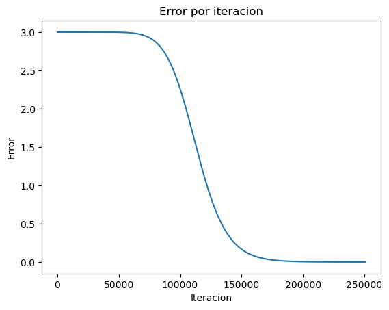

```python
import pandas as pd
import matplotlib.pyplot as plt
```


```python
def funcion_prueba(x):
  return (x**10) - 3
```


```python
results = []
```


```python
def calcular_raiz(f, x_l, x_u, tol=0.01, max_iter=100):

  f_xl = f(x_l)
  f_xu = f(x_u)

  if f_xu * f_xl > 0:
    raise ValueError("No existe raíz en el intervalo dado")

  for i in range(max_iter):

    f_xl = f(x_l)
    f_xu = f(x_u)

    x_r = x_u - (f_xu*(x_l - x_u))/(f_xl - f_xu)
    f_xr = f(x_r)
    error = abs(f_xr)
    results.append([i+1, x_l, x_u, f_xl, f_xu, x_r, f_xr, error])
    if error <= tol:
      return x_r, i+1
    elif f_xl * f_xr < 0:
      x_u = x_r
    elif f_xr * f_xu < 0:
      x_l = x_r

  raise ValueError("No se pudo encontrar la raíz")
```


```python
calcular_raiz(funcion_prueba, 0, 4, 0.0001, 1000000)
```


    (1.1161194537476447, 251045)


```python
df = pd.DataFrame(results, columns=['Iteracion','x_l', 'x_u', 'f_xl', 'f_xu', 'x_r', 'f_xr', 'error'])
```


```python
# plot
fig, ax = plt.subplots()

ax.plot(df['Iteracion'], df['error']) # 'Iteracion' en x, 'Error' en y

plt.title("Error por iteracion")
plt.xlabel("Iteracion")
plt.ylabel("Error")
plt.show()
```


    

    


```python

```
