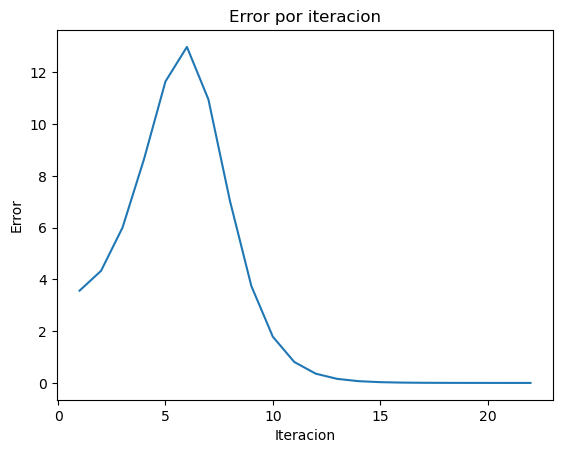

```python
import pandas as pd
import matplotlib.pyplot as plt
```


```python
def funcion_prueba(x):
  return (x**3) + 2*(x**2) - 4*x + 5
```


```python
results = []
```


```python
def calcular_raiz(f, x_l, x_u, tol=0.01, max_iter=100):

  f_xl = f(x_l)
  f_xu = f(x_u)

  if f_xu * f_xl > 0:
    raise ValueError("No existe raíz en el intervalo dado")

  for i in range(max_iter):

    f_xl = f(x_l)
    f_xu = f(x_u)

    x_r = x_u - (f_xu*(x_l - x_u))/(f_xl - f_xu)
    f_xr = f(x_r)
    error = abs(f_xr)
    results.append([i+1, x_l, x_u, f_xl, f_xu, x_r, f_xr, error])
    if error <= tol:
      return x_r, i+1
    elif f_xl * f_xr < 0:
      x_u = x_r
    elif f_xr * f_xu < 0:
      x_l = x_r

  raise ValueError("No se pudo encontrar la raíz")
```


```python
calcular_raiz(funcion_prueba, -5, 2, 0.0001, 1000000)
```


    (-3.5328380821489147, 22)


```python
df = pd.DataFrame(results, columns=['Iteracion','x_l', 'x_u', 'f_xl', 'f_xu', 'x_r', 'f_xr', 'error'])
df
```


<div>
<style scoped>
    .dataframe tbody tr th:only-of-type {
        vertical-align: middle;
    }

    .dataframe tbody tr th {
        vertical-align: top;
    }

    .dataframe thead th {
        text-align: right;
    }
</style>
<table border="1" class="dataframe">
  <thead>
    <tr style="text-align: right;">
      <th></th>
      <th>Iteracion</th>
      <th>x_l</th>
      <th>x_u</th>
      <th>f_xl</th>
      <th>f_xu</th>
      <th>x_r</th>
      <th>f_xr</th>
      <th>error</th>
    </tr>
  </thead>
  <tbody>
    <tr>
      <th>0</th>
      <td>1</td>
      <td>-5</td>
      <td>2.000000</td>
      <td>-50</td>
      <td>13.000000</td>
      <td>0.555556</td>
      <td>3.566529</td>
      <td>3.566529</td>
    </tr>
    <tr>
      <th>1</th>
      <td>2</td>
      <td>-5</td>
      <td>0.555556</td>
      <td>-50</td>
      <td>3.566529</td>
      <td>0.185659</td>
      <td>4.332701</td>
      <td>4.332701</td>
    </tr>
    <tr>
      <th>2</th>
      <td>3</td>
      <td>-5</td>
      <td>0.185659</td>
      <td>-50</td>
      <td>4.332701</td>
      <td>-0.227865</td>
      <td>6.003475</td>
      <td>6.003475</td>
    </tr>
    <tr>
      <th>3</th>
      <td>4</td>
      <td>-5</td>
      <td>-0.227865</td>
      <td>-50</td>
      <td>6.003475</td>
      <td>-0.739430</td>
      <td>8.646944</td>
      <td>8.646944</td>
    </tr>
    <tr>
      <th>4</th>
      <td>5</td>
      <td>-5</td>
      <td>-0.739430</td>
      <td>-50</td>
      <td>8.646944</td>
      <td>-1.367611</td>
      <td>11.653239</td>
      <td>11.653239</td>
    </tr>
    <tr>
      <th>5</th>
      <td>6</td>
      <td>-5</td>
      <td>-1.367611</td>
      <td>-50</td>
      <td>11.653239</td>
      <td>-2.054178</td>
      <td>12.988100</td>
      <td>12.988100</td>
    </tr>
    <tr>
      <th>6</th>
      <td>7</td>
      <td>-5</td>
      <td>-2.054178</td>
      <td>-50</td>
      <td>12.988100</td>
      <td>-2.661605</td>
      <td>10.959520</td>
      <td>10.959520</td>
    </tr>
    <tr>
      <th>7</th>
      <td>8</td>
      <td>-5</td>
      <td>-2.661605</td>
      <td>-50</td>
      <td>10.959520</td>
      <td>-3.082010</td>
      <td>7.050263</td>
      <td>7.050263</td>
    </tr>
    <tr>
      <th>8</th>
      <td>9</td>
      <td>-5</td>
      <td>-3.082010</td>
      <td>-50</td>
      <td>7.050263</td>
      <td>-3.319035</td>
      <td>3.745665</td>
      <td>3.745665</td>
    </tr>
    <tr>
      <th>9</th>
      <td>10</td>
      <td>-5</td>
      <td>-3.319035</td>
      <td>-50</td>
      <td>3.745665</td>
      <td>-3.436185</td>
      <td>1.787173</td>
      <td>1.787173</td>
    </tr>
    <tr>
      <th>10</th>
      <td>11</td>
      <td>-5</td>
      <td>-3.436185</td>
      <td>-50</td>
      <td>1.787173</td>
      <td>-3.490152</td>
      <td>0.808820</td>
      <td>0.808820</td>
    </tr>
    <tr>
      <th>11</th>
      <td>12</td>
      <td>-5</td>
      <td>-3.490152</td>
      <td>-50</td>
      <td>0.808820</td>
      <td>-3.514187</td>
      <td>0.357272</td>
      <td>0.357272</td>
    </tr>
    <tr>
      <th>12</th>
      <td>13</td>
      <td>-5</td>
      <td>-3.514187</td>
      <td>-50</td>
      <td>0.357272</td>
      <td>-3.524729</td>
      <td>0.156120</td>
      <td>0.156120</td>
    </tr>
    <tr>
      <th>13</th>
      <td>14</td>
      <td>-5</td>
      <td>-3.524729</td>
      <td>-50</td>
      <td>0.156120</td>
      <td>-3.529321</td>
      <td>0.067899</td>
      <td>0.067899</td>
    </tr>
    <tr>
      <th>14</th>
      <td>15</td>
      <td>-5</td>
      <td>-3.529321</td>
      <td>-50</td>
      <td>0.067899</td>
      <td>-3.531315</td>
      <td>0.029470</td>
      <td>0.029470</td>
    </tr>
    <tr>
      <th>15</th>
      <td>16</td>
      <td>-5</td>
      <td>-3.531315</td>
      <td>-50</td>
      <td>0.029470</td>
      <td>-3.532181</td>
      <td>0.012779</td>
      <td>0.012779</td>
    </tr>
    <tr>
      <th>16</th>
      <td>17</td>
      <td>-5</td>
      <td>-3.532181</td>
      <td>-50</td>
      <td>0.012779</td>
      <td>-3.532556</td>
      <td>0.005539</td>
      <td>0.005539</td>
    </tr>
    <tr>
      <th>17</th>
      <td>18</td>
      <td>-5</td>
      <td>-3.532556</td>
      <td>-50</td>
      <td>0.005539</td>
      <td>-3.532718</td>
      <td>0.002401</td>
      <td>0.002401</td>
    </tr>
    <tr>
      <th>18</th>
      <td>19</td>
      <td>-5</td>
      <td>-3.532718</td>
      <td>-50</td>
      <td>0.002401</td>
      <td>-3.532789</td>
      <td>0.001040</td>
      <td>0.001040</td>
    </tr>
    <tr>
      <th>19</th>
      <td>20</td>
      <td>-5</td>
      <td>-3.532789</td>
      <td>-50</td>
      <td>0.001040</td>
      <td>-3.532819</td>
      <td>0.000451</td>
      <td>0.000451</td>
    </tr>
    <tr>
      <th>20</th>
      <td>21</td>
      <td>-5</td>
      <td>-3.532819</td>
      <td>-50</td>
      <td>0.000451</td>
      <td>-3.532832</td>
      <td>0.000195</td>
      <td>0.000195</td>
    </tr>
    <tr>
      <th>21</th>
      <td>22</td>
      <td>-5</td>
      <td>-3.532832</td>
      <td>-50</td>
      <td>0.000195</td>
      <td>-3.532838</td>
      <td>0.000085</td>
      <td>0.000085</td>
    </tr>
  </tbody>
</table>
</div>


```python
# plot
fig, ax = plt.subplots()

ax.plot(df['Iteracion'], df['error']) # 'Iteracion' en x, 'Error' en y

plt.title("Error por iteracion")
plt.xlabel("Iteracion")
plt.ylabel("Error")
plt.show()
```


    

    


```python

```
