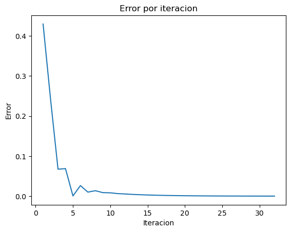

La interpolación cuadrática es un método que se utiliza para obtener máximos y mínimos y optimizarlos.


```python
import math
import pandas as pd
import matplotlib.pyplot as plt
```


```python
def funcion(x):
  return (-1.5*(x**6))-(2*(x**4))+(12*x)
```


```python
results = []
```


```python
def interpolacion_cuadratica(f, x0, x1, x2, tol, max_iter):
  # El valor x3 que calculamos describe un valor crítico de la parábola con la que aproximamos la región.

  for i in range(max_iter):
    f_x0 = f(x0)
    f_x1 = f(x1)
    f_x2 = f(x2)

    x3 = (f_x0*(x1**2 - x2**2) + f_x1*(x2**2 - x0**2) + f_x2*(x0**2 - x1**2)) / (2*f_x0*(x1 - x2) + 2*f_x1*(x2 - x0) + 2*f_x2*(x0 - x1))
    f_x3 = f(x3)
    # Después de calcular x3 hay que reemplazar alguno de los puntos x0, x1 o x2 por este valor.
    # En mi opinión lo más acertado es descartar el punto más lejano a x3
    error = abs(x3 - x1)

    results.append([i+1, x0, x1, x2, x3, f_x0, f_x1, f_x2, f_x3, error])
    if error < tol:
      return x3

    if ((f_x3 > f_x1) and (x3 > x1)):
      x0 = x1
      x1 = x3
    elif ((f_x3 > f_x1) and (x3 < x1)):
      x2 = x1
      x1 = x3
    elif ((f_x3 < f_x1) and (x3 < x1)):
      x0 = x1
      x1 = x3
    elif ((f_x3 < f_x1) and (x3 > x1)):
      x2 = x1
      x1 = x3
  raise Exception("No se encontró una solución")
```


```python
interpolacion_cuadratica(funcion, 0, 1, 2, 0.0001, 1000)
```


    0.9165337326776142


## Plot the results


```python
df = pd.DataFrame(results, columns=['Iteracion', 'x0', 'x1', 'x2', 'x3', 'f(x0)', 'f(x1)', 'f(x2)', 'f(x3)', 'Error'])
df
```


<div>
<style scoped>
    .dataframe tbody tr th:only-of-type {
        vertical-align: middle;
    }

    .dataframe tbody tr th {
        vertical-align: top;
    }

    .dataframe thead th {
        text-align: right;
    }
</style>
<table border="1" class="dataframe">
  <thead>
    <tr style="text-align: right;">
      <th></th>
      <th>Iteracion</th>
      <th>x0</th>
      <th>x1</th>
      <th>x2</th>
      <th>x3</th>
      <th>f(x0)</th>
      <th>f(x1)</th>
      <th>f(x2)</th>
      <th>f(x3)</th>
      <th>Error</th>
    </tr>
  </thead>
  <tbody>
    <tr>
      <th>0</th>
      <td>1</td>
      <td>0.000000</td>
      <td>1.000000</td>
      <td>2</td>
      <td>0.570248</td>
      <td>0.000000</td>
      <td>8.500000</td>
      <td>-104.0</td>
      <td>6.579909</td>
      <td>0.429752</td>
    </tr>
    <tr>
      <th>1</th>
      <td>2</td>
      <td>1.000000</td>
      <td>0.570248</td>
      <td>2</td>
      <td>0.812431</td>
      <td>8.500000</td>
      <td>6.579909</td>
      <td>-104.0</td>
      <td>8.446523</td>
      <td>0.242183</td>
    </tr>
    <tr>
      <th>2</th>
      <td>3</td>
      <td>0.570248</td>
      <td>0.812431</td>
      <td>2</td>
      <td>0.745150</td>
      <td>6.579909</td>
      <td>8.446523</td>
      <td>-104.0</td>
      <td>8.068423</td>
      <td>0.067281</td>
    </tr>
    <tr>
      <th>3</th>
      <td>4</td>
      <td>0.812431</td>
      <td>0.745150</td>
      <td>2</td>
      <td>0.813942</td>
      <td>8.446523</td>
      <td>8.068423</td>
      <td>-104.0</td>
      <td>8.453323</td>
      <td>0.068792</td>
    </tr>
    <tr>
      <th>4</th>
      <td>5</td>
      <td>0.745150</td>
      <td>0.813942</td>
      <td>2</td>
      <td>0.814509</td>
      <td>8.068423</td>
      <td>8.453323</td>
      <td>-104.0</td>
      <td>8.455849</td>
      <td>0.000566</td>
    </tr>
    <tr>
      <th>5</th>
      <td>6</td>
      <td>0.813942</td>
      <td>0.814509</td>
      <td>2</td>
      <td>0.840860</td>
      <td>8.453323</td>
      <td>8.455849</td>
      <td>-104.0</td>
      <td>8.560301</td>
      <td>0.026351</td>
    </tr>
    <tr>
      <th>6</th>
      <td>7</td>
      <td>0.814509</td>
      <td>0.840860</td>
      <td>2</td>
      <td>0.850931</td>
      <td>8.455849</td>
      <td>8.560301</td>
      <td>-104.0</td>
      <td>8.593125</td>
      <td>0.010071</td>
    </tr>
    <tr>
      <th>7</th>
      <td>8</td>
      <td>0.840860</td>
      <td>0.850931</td>
      <td>2</td>
      <td>0.864553</td>
      <td>8.560301</td>
      <td>8.593125</td>
      <td>-104.0</td>
      <td>8.630883</td>
      <td>0.013622</td>
    </tr>
    <tr>
      <th>8</th>
      <td>9</td>
      <td>0.850931</td>
      <td>0.864553</td>
      <td>2</td>
      <td>0.873360</td>
      <td>8.593125</td>
      <td>8.630883</td>
      <td>-104.0</td>
      <td>8.651063</td>
      <td>0.008806</td>
    </tr>
    <tr>
      <th>9</th>
      <td>10</td>
      <td>0.864553</td>
      <td>0.873360</td>
      <td>2</td>
      <td>0.881676</td>
      <td>8.630883</td>
      <td>8.651063</td>
      <td>-104.0</td>
      <td>8.666953</td>
      <td>0.008316</td>
    </tr>
    <tr>
      <th>10</th>
      <td>11</td>
      <td>0.873360</td>
      <td>0.881676</td>
      <td>2</td>
      <td>0.888003</td>
      <td>8.651063</td>
      <td>8.666953</td>
      <td>-104.0</td>
      <td>8.676924</td>
      <td>0.006327</td>
    </tr>
    <tr>
      <th>11</th>
      <td>12</td>
      <td>0.881676</td>
      <td>0.888003</td>
      <td>2</td>
      <td>0.893402</td>
      <td>8.666953</td>
      <td>8.676924</td>
      <td>-104.0</td>
      <td>8.683949</td>
      <td>0.005399</td>
    </tr>
    <tr>
      <th>12</th>
      <td>13</td>
      <td>0.888003</td>
      <td>0.893402</td>
      <td>2</td>
      <td>0.897717</td>
      <td>8.676924</td>
      <td>8.683949</td>
      <td>-104.0</td>
      <td>8.688563</td>
      <td>0.004315</td>
    </tr>
    <tr>
      <th>13</th>
      <td>14</td>
      <td>0.893402</td>
      <td>0.897717</td>
      <td>2</td>
      <td>0.901286</td>
      <td>8.683949</td>
      <td>8.688563</td>
      <td>-104.0</td>
      <td>8.691696</td>
      <td>0.003569</td>
    </tr>
    <tr>
      <th>14</th>
      <td>15</td>
      <td>0.897717</td>
      <td>0.901286</td>
      <td>2</td>
      <td>0.904179</td>
      <td>8.688563</td>
      <td>8.691696</td>
      <td>-104.0</td>
      <td>8.693776</td>
      <td>0.002893</td>
    </tr>
    <tr>
      <th>15</th>
      <td>16</td>
      <td>0.901286</td>
      <td>0.904179</td>
      <td>2</td>
      <td>0.906547</td>
      <td>8.691696</td>
      <td>8.693776</td>
      <td>-104.0</td>
      <td>8.695169</td>
      <td>0.002368</td>
    </tr>
    <tr>
      <th>16</th>
      <td>17</td>
      <td>0.904179</td>
      <td>0.906547</td>
      <td>2</td>
      <td>0.908474</td>
      <td>8.693776</td>
      <td>8.695169</td>
      <td>-104.0</td>
      <td>8.696096</td>
      <td>0.001926</td>
    </tr>
    <tr>
      <th>17</th>
      <td>18</td>
      <td>0.906547</td>
      <td>0.908474</td>
      <td>2</td>
      <td>0.910045</td>
      <td>8.695169</td>
      <td>8.696096</td>
      <td>-104.0</td>
      <td>8.696713</td>
      <td>0.001571</td>
    </tr>
    <tr>
      <th>18</th>
      <td>19</td>
      <td>0.908474</td>
      <td>0.910045</td>
      <td>2</td>
      <td>0.911324</td>
      <td>8.696096</td>
      <td>8.696713</td>
      <td>-104.0</td>
      <td>8.697123</td>
      <td>0.001279</td>
    </tr>
    <tr>
      <th>19</th>
      <td>20</td>
      <td>0.910045</td>
      <td>0.911324</td>
      <td>2</td>
      <td>0.912366</td>
      <td>8.696713</td>
      <td>8.697123</td>
      <td>-104.0</td>
      <td>8.697395</td>
      <td>0.001042</td>
    </tr>
    <tr>
      <th>20</th>
      <td>21</td>
      <td>0.911324</td>
      <td>0.912366</td>
      <td>2</td>
      <td>0.913214</td>
      <td>8.697123</td>
      <td>8.697395</td>
      <td>-104.0</td>
      <td>8.697575</td>
      <td>0.000848</td>
    </tr>
    <tr>
      <th>21</th>
      <td>22</td>
      <td>0.912366</td>
      <td>0.913214</td>
      <td>2</td>
      <td>0.913904</td>
      <td>8.697395</td>
      <td>8.697575</td>
      <td>-104.0</td>
      <td>8.697695</td>
      <td>0.000690</td>
    </tr>
    <tr>
      <th>22</th>
      <td>23</td>
      <td>0.913214</td>
      <td>0.913904</td>
      <td>2</td>
      <td>0.914466</td>
      <td>8.697575</td>
      <td>8.697695</td>
      <td>-104.0</td>
      <td>8.697774</td>
      <td>0.000562</td>
    </tr>
    <tr>
      <th>23</th>
      <td>24</td>
      <td>0.913904</td>
      <td>0.914466</td>
      <td>2</td>
      <td>0.914923</td>
      <td>8.697695</td>
      <td>8.697774</td>
      <td>-104.0</td>
      <td>8.697827</td>
      <td>0.000457</td>
    </tr>
    <tr>
      <th>24</th>
      <td>25</td>
      <td>0.914466</td>
      <td>0.914923</td>
      <td>2</td>
      <td>0.915295</td>
      <td>8.697774</td>
      <td>8.697827</td>
      <td>-104.0</td>
      <td>8.697862</td>
      <td>0.000372</td>
    </tr>
    <tr>
      <th>25</th>
      <td>26</td>
      <td>0.914923</td>
      <td>0.915295</td>
      <td>2</td>
      <td>0.915597</td>
      <td>8.697827</td>
      <td>8.697862</td>
      <td>-104.0</td>
      <td>8.697885</td>
      <td>0.000302</td>
    </tr>
    <tr>
      <th>26</th>
      <td>27</td>
      <td>0.915295</td>
      <td>0.915597</td>
      <td>2</td>
      <td>0.915843</td>
      <td>8.697862</td>
      <td>8.697885</td>
      <td>-104.0</td>
      <td>8.697900</td>
      <td>0.000246</td>
    </tr>
    <tr>
      <th>27</th>
      <td>28</td>
      <td>0.915597</td>
      <td>0.915843</td>
      <td>2</td>
      <td>0.916043</td>
      <td>8.697885</td>
      <td>8.697900</td>
      <td>-104.0</td>
      <td>8.697910</td>
      <td>0.000200</td>
    </tr>
    <tr>
      <th>28</th>
      <td>29</td>
      <td>0.915843</td>
      <td>0.916043</td>
      <td>2</td>
      <td>0.916206</td>
      <td>8.697900</td>
      <td>8.697910</td>
      <td>-104.0</td>
      <td>8.697917</td>
      <td>0.000163</td>
    </tr>
    <tr>
      <th>29</th>
      <td>30</td>
      <td>0.916043</td>
      <td>0.916206</td>
      <td>2</td>
      <td>0.916338</td>
      <td>8.697910</td>
      <td>8.697917</td>
      <td>-104.0</td>
      <td>8.697921</td>
      <td>0.000132</td>
    </tr>
    <tr>
      <th>30</th>
      <td>31</td>
      <td>0.916206</td>
      <td>0.916338</td>
      <td>2</td>
      <td>0.916446</td>
      <td>8.697917</td>
      <td>8.697921</td>
      <td>-104.0</td>
      <td>8.697924</td>
      <td>0.000108</td>
    </tr>
    <tr>
      <th>31</th>
      <td>32</td>
      <td>0.916338</td>
      <td>0.916446</td>
      <td>2</td>
      <td>0.916534</td>
      <td>8.697921</td>
      <td>8.697924</td>
      <td>-104.0</td>
      <td>8.697926</td>
      <td>0.000088</td>
    </tr>
  </tbody>
</table>
</div>


```python
# plot
fig, ax = plt.subplots()

ax.plot(df['Iteracion'], df['Error']) # 'Iteracion' en x, 'Error' en y

plt.title("Error por iteracion")
plt.xlabel("Iteracion")
plt.ylabel("Error")
plt.show()
```


    

    


```python

```
