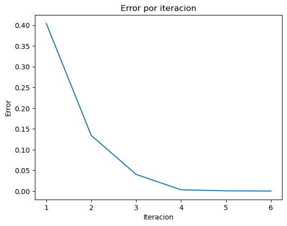

La interpolación cuadrática es un método que se utiliza para obtener máximos y mínimos y optimizarlos.


```python
import math
import pandas as pd
import matplotlib.pyplot as plt
```


```python
def funcion(x):
  return ((math.e)**x) - 2*x
```


```python
results = []
```


```python
def interpolacion_cuadratica(f, x0, x1, x2, tol, max_iter):
  # El valor x3 que calculamos describe un valor crítico de la parábola con la que aproximamos la región.

  for i in range(max_iter):
    f_x0 = f(x0)
    f_x1 = f(x1)
    f_x2 = f(x2)

    x3 = (f_x0*(x1**2 - x2**2) + f_x1*(x2**2 - x0**2) + f_x2*(x0**2 - x1**2)) / (2*f_x0*(x1 - x2) + 2*f_x1*(x2 - x0) + 2*f_x2*(x0 - x1))
    f_x3 = f(x3)
    # Después de calcular x3 hay que reemplazar alguno de los puntos x0, x1 o x2 por este valor.
    # En mi opinión lo más acertado es descartar el punto más lejano a x3
    error = abs(x3 - x1)

    results.append([i+1, x0, x1, x2, x3, f_x0, f_x1, f_x2, f_x3, error])
    if error < tol:
      return x3

    if ((f_x3 > f_x1) and (x3 > x1)):
      x0 = x1
      x1 = x3
    elif ((f_x3 > f_x1) and (x3 < x1)):
      x2 = x1
      x1 = x3
    elif ((f_x3 < f_x1) and (x3 < x1)):
      x0 = x1
      x1 = x3
    elif ((f_x3 < f_x1) and (x3 > x1)):
      x2 = x1
      x1 = x3
  raise Exception("No se encontró una solución")
```


```python
interpolacion_cuadratica(funcion, 0, 1, 2, 0.0001, 1000)
```


    0.6931436053634965


## Plot the results


```python
df = pd.DataFrame(results, columns=['Iteracion', 'x0', 'x1', 'x2', 'x3', 'f(x0)', 'f(x1)', 'f(x2)', 'f(x3)', 'Error'])
df
```


<div>
<style scoped>
    .dataframe tbody tr th:only-of-type {
        vertical-align: middle;
    }

    .dataframe tbody tr th {
        vertical-align: top;
    }

    .dataframe thead th {
        text-align: right;
    }
</style>
<table border="1" class="dataframe">
  <thead>
    <tr style="text-align: right;">
      <th></th>
      <th>Iteracion</th>
      <th>x0</th>
      <th>x1</th>
      <th>x2</th>
      <th>x3</th>
      <th>f(x0)</th>
      <th>f(x1)</th>
      <th>f(x2)</th>
      <th>f(x3)</th>
      <th>Error</th>
    </tr>
  </thead>
  <tbody>
    <tr>
      <th>0</th>
      <td>1</td>
      <td>0.000000</td>
      <td>1.000000</td>
      <td>2.000000</td>
      <td>0.595417</td>
      <td>1.000000</td>
      <td>0.718282</td>
      <td>3.389056</td>
      <td>0.622953</td>
      <td>0.404583</td>
    </tr>
    <tr>
      <th>1</th>
      <td>2</td>
      <td>1.000000</td>
      <td>0.595417</td>
      <td>2.000000</td>
      <td>0.729756</td>
      <td>0.718282</td>
      <td>0.622953</td>
      <td>3.389056</td>
      <td>0.615062</td>
      <td>0.134339</td>
    </tr>
    <tr>
      <th>2</th>
      <td>3</td>
      <td>1.000000</td>
      <td>0.729756</td>
      <td>0.595417</td>
      <td>0.689549</td>
      <td>0.718282</td>
      <td>0.615062</td>
      <td>0.622953</td>
      <td>0.613719</td>
      <td>0.040206</td>
    </tr>
    <tr>
      <th>3</th>
      <td>4</td>
      <td>0.729756</td>
      <td>0.689549</td>
      <td>0.595417</td>
      <td>0.692584</td>
      <td>0.615062</td>
      <td>0.613719</td>
      <td>0.622953</td>
      <td>0.613706</td>
      <td>0.003035</td>
    </tr>
    <tr>
      <th>4</th>
      <td>5</td>
      <td>0.729756</td>
      <td>0.692584</td>
      <td>0.689549</td>
      <td>0.693122</td>
      <td>0.615062</td>
      <td>0.613706</td>
      <td>0.613719</td>
      <td>0.613706</td>
      <td>0.000538</td>
    </tr>
    <tr>
      <th>5</th>
      <td>6</td>
      <td>0.729756</td>
      <td>0.693122</td>
      <td>0.692584</td>
      <td>0.693144</td>
      <td>0.615062</td>
      <td>0.613706</td>
      <td>0.613706</td>
      <td>0.613706</td>
      <td>0.000021</td>
    </tr>
  </tbody>
</table>
</div>


```python
# plot
fig, ax = plt.subplots()

ax.plot(df['Iteracion'], df['Error']) # 'Iteracion' en x, 'Error' en y

plt.title("Error por iteracion")
plt.xlabel("Iteracion")
plt.ylabel("Error")
plt.show()
```


    

    


```python

```
