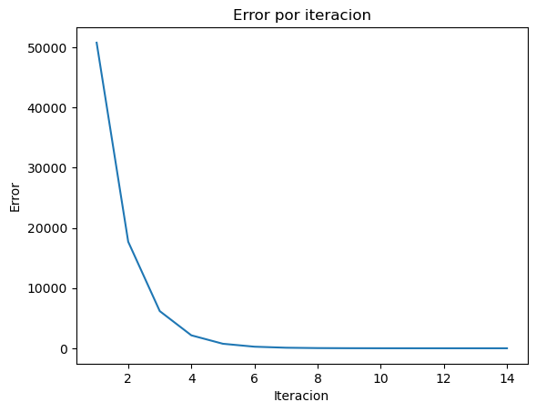
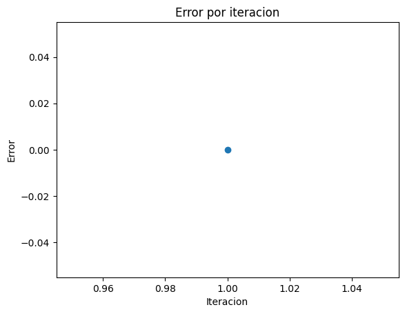

## Import libraries


```python
import sympy as sp
import pandas as pd
import matplotlib.pyplot as plt
```


```python
# Arrays para almacenar los resultados de ambos métodos
results_raiz = []
results_minimizar = []
```

## Define functions to use the methods


```python
def funcion_ejemplo(x):
  return (x**10)-3
```

## Newton-Raphson method to find root of function


```python
def raiz(f, x_inicial, max_iter, tol):
  # Definir variable x
  x = sp.Symbol('x')
  # Obtener derivada de la funcion ingresada
  derivative_x = sp.diff(f(x), x)

  x_i = x_inicial
  for i in range(max_iter):
    # Obtain next value
    x_i = x_i - f(x_i)/derivative_x.subs(x, x_i)
    f_xi = f(x_i)
    error = abs(f_xi.evalf())
    results_raiz.append([i+1, x_i.evalf(), f_xi.evalf(), error])
    if abs(f_xi) <= tol:
      return x_i.evalf()

  raise Exception("Max iterations reached")
```


```python
raiz(funcion_ejemplo, 0.8, 100, 0.0001)
```


$\displaystyle 1.11612317423391$


## Newton method to find local critical point


```python
def minimizar(f, x_inicial, max_iter, tol):
  # Definir variable x
  x = sp.Symbol('x')
  # Obtener derivada y segunda derivada de la funcion ingresada
  derivative_x = sp.diff(f(x), x)
  second_derivative_x = sp.diff(derivative_x, x)
  x_i = x_inicial

  for i in range(max_iter):
    # Obtain next value
    x_i = x_i - derivative_x.subs(x, x_i)/second_derivative_x.subs(x, x_i)
    eval_derivative = derivative_x.subs(x, x_i)
    eval_second_derivative = second_derivative_x.subs(x, x_i)
    error = abs(eval_derivative)
    results_minimizar.append([i+1, x_i.evalf(), eval_derivative.evalf(), eval_second_derivative.evalf(), error])
    if abs(eval_derivative) <= tol:
      return x_i.evalf()

  raise Exception("Max iterations reached")
```


```python
minimizar(funcion_ejemplo, 5, 40, 0.1)
```


$\displaystyle -1.5$


## Plot de resultados


```python
df_raiz = pd.DataFrame(results_raiz, columns=['Iteracion', 'x_i', 'f_xi', 'error'])
df_raiz
```


<div>
<style scoped>
    .dataframe tbody tr th:only-of-type {
        vertical-align: middle;
    }

    .dataframe tbody tr th {
        vertical-align: top;
    }

    .dataframe thead th {
        text-align: right;
    }
</style>
<table border="1" class="dataframe">
  <thead>
    <tr style="text-align: right;">
      <th></th>
      <th>Iteracion</th>
      <th>x_i</th>
      <th>f_xi</th>
      <th>error</th>
    </tr>
  </thead>
  <tbody>
    <tr>
      <th>0</th>
      <td>1</td>
      <td>2.95517417907715</td>
      <td>50793.1543896900</td>
      <td>50793.1543896900</td>
    </tr>
    <tr>
      <th>1</th>
      <td>2</td>
      <td>2.65967421430667</td>
      <td>17709.6861714648</td>
      <td>17709.6861714648</td>
    </tr>
    <tr>
      <th>2</th>
      <td>3</td>
      <td>2.39375183981335</td>
      <td>6174.19414414532</td>
      <td>6174.19414414532</td>
    </tr>
    <tr>
      <th>3</th>
      <td>4</td>
      <td>2.15449291015966</td>
      <td>2152.01696211350</td>
      <td>2152.01696211350</td>
    </tr>
    <tr>
      <th>4</th>
      <td>5</td>
      <td>1.93934354619040</td>
      <td>749.571023531887</td>
      <td>749.571023531887</td>
    </tr>
    <tr>
      <th>5</th>
      <td>6</td>
      <td>1.74618227882248</td>
      <td>260.569871336499</td>
      <td>260.569871336499</td>
    </tr>
    <tr>
      <th>6</th>
      <td>7</td>
      <td>1.57355158722802</td>
      <td>90.0700299541554</td>
      <td>90.0700299541554</td>
    </tr>
    <tr>
      <th>7</th>
      <td>8</td>
      <td>1.42126858198363</td>
      <td>30.6326864100601</td>
      <td>30.6326864100601</td>
    </tr>
    <tr>
      <th>8</th>
      <td>9</td>
      <td>1.29181928897874</td>
      <td>9.94248438965968</td>
      <td>9.94248438965968</td>
    </tr>
    <tr>
      <th>9</th>
      <td>10</td>
      <td>1.19258105365822</td>
      <td>2.81941132635022</td>
      <td>2.81941132635022</td>
    </tr>
    <tr>
      <th>10</th>
      <td>11</td>
      <td>1.13480241692481</td>
      <td>0.541624562185526</td>
      <td>0.541624562185526</td>
    </tr>
    <tr>
      <th>11</th>
      <td>12</td>
      <td>1.11744775802628</td>
      <td>0.0357939078228418</td>
      <td>0.0357939078228418</td>
    </tr>
    <tr>
      <th>12</th>
      <td>13</td>
      <td>1.11613021726883</td>
      <td>0.000189318753500700</td>
      <td>0.000189318753500700</td>
    </tr>
    <tr>
      <th>13</th>
      <td>14</td>
      <td>1.11612317423391</td>
      <td>5.37580913118063e-9</td>
      <td>5.37580913118063e-9</td>
    </tr>
  </tbody>
</table>
</div>


```python
df_minimizar = pd.DataFrame(results_minimizar, columns=['Iteracion', 'x_i', 'derivative_xi', 'second_derivative_xi', 'error'])
df_minimizar
```


  <div id="df-dc406be3-0d15-4e11-bb5b-330a4eb70203" class="colab-df-container">
    <div>
<style scoped>
    .dataframe tbody tr th:only-of-type {
        vertical-align: middle;
    }

    .dataframe tbody tr th {
        vertical-align: top;
    }

    .dataframe thead th {
        text-align: right;
    }
</style>
<table border="1" class="dataframe">
  <thead>
    <tr style="text-align: right;">
      <th></th>
      <th>Iteracion</th>
      <th>x_i</th>
      <th>derivative_xi</th>
      <th>second_derivative_xi</th>
      <th>error</th>
    </tr>
  </thead>
  <tbody>
    <tr>
      <th>0</th>
      <td>1</td>
      <td>-1.50000000000000</td>
      <td>0</td>
      <td>2.00000000000000</td>
      <td>0</td>
    </tr>
  </tbody>
</table>
</div>
    <div class="colab-df-buttons">

  <div class="colab-df-container">
    <button class="colab-df-convert" onclick="convertToInteractive('df-dc406be3-0d15-4e11-bb5b-330a4eb70203')"
            title="Convert this dataframe to an interactive table."
            style="display:none;">

  <svg xmlns="http://www.w3.org/2000/svg" height="24px" viewBox="0 -960 960 960">
    <path d="M120-120v-720h720v720H120Zm60-500h600v-160H180v160Zm220 220h160v-160H400v160Zm0 220h160v-160H400v160ZM180-400h160v-160H180v160Zm440 0h160v-160H620v160ZM180-180h160v-160H180v160Zm440 0h160v-160H620v160Z"/>
  </svg>
    </button>

  <style>
    .colab-df-container {
      display:flex;
      gap: 12px;
    }

    .colab-df-convert {
      background-color: #E8F0FE;
      border: none;
      border-radius: 50%;
      cursor: pointer;
      display: none;
      fill: #1967D2;
      height: 32px;
      padding: 0 0 0 0;
      width: 32px;
    }

    .colab-df-convert:hover {
      background-color: #E2EBFA;
      box-shadow: 0px 1px 2px rgba(60, 64, 67, 0.3), 0px 1px 3px 1px rgba(60, 64, 67, 0.15);
      fill: #174EA6;
    }

    .colab-df-buttons div {
      margin-bottom: 4px;
    }

    [theme=dark] .colab-df-convert {
      background-color: #3B4455;
      fill: #D2E3FC;
    }

    [theme=dark] .colab-df-convert:hover {
      background-color: #434B5C;
      box-shadow: 0px 1px 3px 1px rgba(0, 0, 0, 0.15);
      filter: drop-shadow(0px 1px 2px rgba(0, 0, 0, 0.3));
      fill: #FFFFFF;
    }
  </style>

    <script>
      const buttonEl =
        document.querySelector('#df-dc406be3-0d15-4e11-bb5b-330a4eb70203 button.colab-df-convert');
      buttonEl.style.display =
        google.colab.kernel.accessAllowed ? 'block' : 'none';

      async function convertToInteractive(key) {
        const element = document.querySelector('#df-dc406be3-0d15-4e11-bb5b-330a4eb70203');
        const dataTable =
          await google.colab.kernel.invokeFunction('convertToInteractive',
                                                    [key], {});
        if (!dataTable) return;

        const docLinkHtml = 'Like what you see? Visit the ' +
          '<a target="_blank" href=https://colab.research.google.com/notebooks/data_table.ipynb>data table notebook</a>'
          + ' to learn more about interactive tables.';
        element.innerHTML = '';
        dataTable['output_type'] = 'display_data';
        await google.colab.output.renderOutput(dataTable, element);
        const docLink = document.createElement('div');
        docLink.innerHTML = docLinkHtml;
        element.appendChild(docLink);
      }
    </script>
  </div>


  <div id="id_89b9b271-f34e-4fd1-9d7a-3f8da3d4bf22">
    <style>
      .colab-df-generate {
        background-color: #E8F0FE;
        border: none;
        border-radius: 50%;
        cursor: pointer;
        display: none;
        fill: #1967D2;
        height: 32px;
        padding: 0 0 0 0;
        width: 32px;
      }

      .colab-df-generate:hover {
        background-color: #E2EBFA;
        box-shadow: 0px 1px 2px rgba(60, 64, 67, 0.3), 0px 1px 3px 1px rgba(60, 64, 67, 0.15);
        fill: #174EA6;
      }

      [theme=dark] .colab-df-generate {
        background-color: #3B4455;
        fill: #D2E3FC;
      }

      [theme=dark] .colab-df-generate:hover {
        background-color: #434B5C;
        box-shadow: 0px 1px 3px 1px rgba(0, 0, 0, 0.15);
        filter: drop-shadow(0px 1px 2px rgba(0, 0, 0, 0.3));
        fill: #FFFFFF;
      }
    </style>
    <button class="colab-df-generate" onclick="generateWithVariable('df_minimizar')"
            title="Generate code using this dataframe."
            style="display:none;">

  <svg xmlns="http://www.w3.org/2000/svg" height="24px"viewBox="0 0 24 24"
       width="24px">
    <path d="M7,19H8.4L18.45,9,17,7.55,7,17.6ZM5,21V16.75L18.45,3.32a2,2,0,0,1,2.83,0l1.4,1.43a1.91,1.91,0,0,1,.58,1.4,1.91,1.91,0,0,1-.58,1.4L9.25,21ZM18.45,9,17,7.55Zm-12,3A5.31,5.31,0,0,0,4.9,8.1,5.31,5.31,0,0,0,1,6.5,5.31,5.31,0,0,0,4.9,4.9,5.31,5.31,0,0,0,6.5,1,5.31,5.31,0,0,0,8.1,4.9,5.31,5.31,0,0,0,12,6.5,5.46,5.46,0,0,0,6.5,12Z"/>
  </svg>
    </button>
    <script>
      (() => {
      const buttonEl =
        document.querySelector('#id_89b9b271-f34e-4fd1-9d7a-3f8da3d4bf22 button.colab-df-generate');
      buttonEl.style.display =
        google.colab.kernel.accessAllowed ? 'block' : 'none';

      buttonEl.onclick = () => {
        google.colab.notebook.generateWithVariable('df_minimizar');
      }
      })();
    </script>
  </div>

    </div>
  </div>


```python
# plot
fig, ax = plt.subplots()

ax.plot(df_raiz['Iteracion'], df_raiz['error']) # 'Iteracion' en x, 'Error' en y

plt.title("Error por iteracion")
plt.xlabel("Iteracion")
plt.ylabel("Error")
plt.show()
```


    

    


El punto mínimo se halla en muy pocas iteraciones, en ciertos casos en la primera iteración ya se encuentra aquel valor. Por lo que vamos a utilizar un scatter plot par


```python
# plot
fig, ax = plt.subplots()

ax.scatter(df_minimizar['Iteracion'], df_minimizar['error']) # 'Iteracion' en x, 'Error' en y

plt.title("Error por iteracion")
plt.xlabel("Iteracion")
plt.ylabel("Error")
plt.show()
```


    

    

