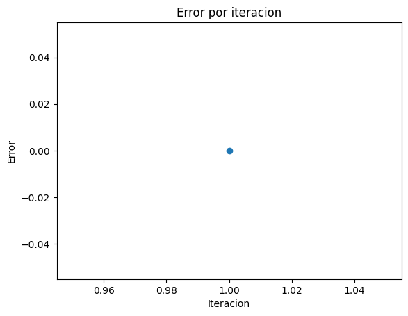

## Import libraries


```python
import sympy as sp
import pandas as pd
import matplotlib.pyplot as plt
```


```python
# Arrays para almacenar los resultados de ambos métodos
results_raiz = []
results_minimizar = []
```

## Define functions to use the methods


```python
def funcion_ejemplo(x):
  return (x**2)+(2*x)-9
```

## Newton-Raphson method to find root of function


```python
def raiz(f, x_inicial, max_iter, tol):
  # Definir variable x
  x = sp.Symbol('x')
  # Obtener derivada de la funcion ingresada
  derivative_x = sp.diff(f(x), x)

  x_i = x_inicial
  for i in range(max_iter):
    # Obtain next value
    x_i = x_i - f(x_i)/derivative_x.subs(x, x_i)
    f_xi = f(x_i)
    error = abs(f_xi.evalf())
    results_raiz.append([i+1, x_i.evalf(), f_xi.evalf(), error])
    if abs(f_xi) <= tol:
      return x_i.evalf()

  raise Exception("Max iterations reached")
```


```python
raiz(funcion_ejemplo, 0.8, 100, 0.0001)
```

## Newton method to find local critical point


```python
def minimizar(f, x_inicial, max_iter, tol):
  # Definir variable x
  x = sp.Symbol('x')
  # Obtener derivada y segunda derivada de la funcion ingresada
  derivative_x = sp.diff(f(x), x)
  second_derivative_x = sp.diff(derivative_x, x)
  x_i = x_inicial

  for i in range(max_iter):
    # Obtain next value
    x_i = x_i - derivative_x.subs(x, x_i)/second_derivative_x.subs(x, x_i)
    eval_derivative = derivative_x.subs(x, x_i)
    eval_second_derivative = second_derivative_x.subs(x, x_i)
    error = abs(eval_derivative)
    results_minimizar.append([i+1, x_i.evalf(), eval_derivative.evalf(), eval_second_derivative.evalf(), error])
    if abs(eval_derivative) <= tol:
      return x_i.evalf()

  raise Exception("Max iterations reached")
```


```python
minimizar(funcion_ejemplo, -4, 100, 0.0001)
```


$\displaystyle -1.0$


## Plot de resultados


```python
df_raiz = pd.DataFrame(results_raiz, columns=['Iteracion', 'x_i', 'f_xi', 'error'])
df_raiz
```


<div>
<style scoped>
    .dataframe tbody tr th:only-of-type {
        vertical-align: middle;
    }

    .dataframe tbody tr th {
        vertical-align: top;
    }

    .dataframe thead th {
        text-align: right;
    }
</style>
<table border="1" class="dataframe">
  <thead>
    <tr style="text-align: right;">
      <th></th>
      <th>Iteracion</th>
      <th>x_i</th>
      <th>f_xi</th>
      <th>error</th>
    </tr>
  </thead>
  <tbody>
    <tr>
      <th>0</th>
      <td>1</td>
      <td>2.95517417907715</td>
      <td>50793.1543896900</td>
      <td>50793.1543896900</td>
    </tr>
    <tr>
      <th>1</th>
      <td>2</td>
      <td>2.65967421430667</td>
      <td>17709.6861714648</td>
      <td>17709.6861714648</td>
    </tr>
    <tr>
      <th>2</th>
      <td>3</td>
      <td>2.39375183981335</td>
      <td>6174.19414414532</td>
      <td>6174.19414414532</td>
    </tr>
    <tr>
      <th>3</th>
      <td>4</td>
      <td>2.15449291015966</td>
      <td>2152.01696211350</td>
      <td>2152.01696211350</td>
    </tr>
    <tr>
      <th>4</th>
      <td>5</td>
      <td>1.93934354619040</td>
      <td>749.571023531887</td>
      <td>749.571023531887</td>
    </tr>
    <tr>
      <th>5</th>
      <td>6</td>
      <td>1.74618227882248</td>
      <td>260.569871336499</td>
      <td>260.569871336499</td>
    </tr>
    <tr>
      <th>6</th>
      <td>7</td>
      <td>1.57355158722802</td>
      <td>90.0700299541554</td>
      <td>90.0700299541554</td>
    </tr>
    <tr>
      <th>7</th>
      <td>8</td>
      <td>1.42126858198363</td>
      <td>30.6326864100601</td>
      <td>30.6326864100601</td>
    </tr>
    <tr>
      <th>8</th>
      <td>9</td>
      <td>1.29181928897874</td>
      <td>9.94248438965968</td>
      <td>9.94248438965968</td>
    </tr>
    <tr>
      <th>9</th>
      <td>10</td>
      <td>1.19258105365822</td>
      <td>2.81941132635022</td>
      <td>2.81941132635022</td>
    </tr>
    <tr>
      <th>10</th>
      <td>11</td>
      <td>1.13480241692481</td>
      <td>0.541624562185526</td>
      <td>0.541624562185526</td>
    </tr>
    <tr>
      <th>11</th>
      <td>12</td>
      <td>1.11744775802628</td>
      <td>0.0357939078228418</td>
      <td>0.0357939078228418</td>
    </tr>
    <tr>
      <th>12</th>
      <td>13</td>
      <td>1.11613021726883</td>
      <td>0.000189318753500700</td>
      <td>0.000189318753500700</td>
    </tr>
    <tr>
      <th>13</th>
      <td>14</td>
      <td>1.11612317423391</td>
      <td>5.37580913118063e-9</td>
      <td>5.37580913118063e-9</td>
    </tr>
  </tbody>
</table>
</div>


```python
df_minimizar = pd.DataFrame(results_minimizar, columns=['Iteracion', 'x_i', 'derivative_xi', 'second_derivative_xi', 'error'])
df_minimizar
```


<div>
<style scoped>
    .dataframe tbody tr th:only-of-type {
        vertical-align: middle;
    }

    .dataframe tbody tr th {
        vertical-align: top;
    }

    .dataframe thead th {
        text-align: right;
    }
</style>
<table border="1" class="dataframe">
  <thead>
    <tr style="text-align: right;">
      <th></th>
      <th>Iteracion</th>
      <th>x_i</th>
      <th>derivative_xi</th>
      <th>second_derivative_xi</th>
      <th>error</th>
    </tr>
  </thead>
  <tbody>
    <tr>
      <th>0</th>
      <td>1</td>
      <td>-1.00000000000000</td>
      <td>0</td>
      <td>2.00000000000000</td>
      <td>0</td>
    </tr>
  </tbody>
</table>
</div>


```python
# plot
fig, ax = plt.subplots()

ax.plot(df_raiz['Iteracion'], df_raiz['error']) # 'Iteracion' en x, 'Error' en y

plt.title("Error por iteracion")
plt.xlabel("Iteracion")
plt.ylabel("Error")
plt.show()
```


    

    


El punto mínimo se halla en muy pocas iteraciones, en ciertos casos en la primera iteración ya se encuentra aquel valor. Por lo que vamos a utilizar un scatter plot par


```python
# plot
fig, ax = plt.subplots()

ax.scatter(df_minimizar['Iteracion'], df_minimizar['error']) # 'Iteracion' en x, 'Error' en y

plt.title("Error por iteracion")
plt.xlabel("Iteracion")
plt.ylabel("Error")
plt.show()
```


    

    


```python

```
