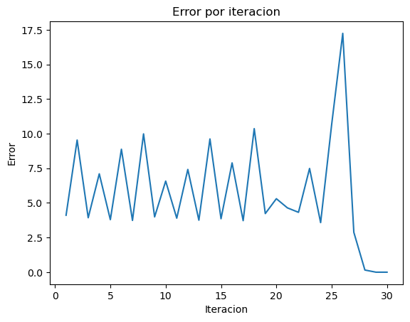

## Import libraries


```python
import sympy as sp
import pandas as pd
import matplotlib.pyplot as plt
```


```python
# Arrays para almacenar los resultados de ambos métodos
results_raiz = []
results_minimizar = []
```

## Define functions to use the methods


```python
def funcion_ejemplo(x):
  return (x**3) + 2*(x**2) - 4*x  + 5
```

## Newton-Raphson method to find root of function


```python
def raiz(f, x_inicial, max_iter, tol):
  # Definir variable x
  x = sp.Symbol('x')
  # Obtener derivada de la funcion ingresada
  derivative_x = sp.diff(f(x), x)

  x_i = x_inicial
  for i in range(max_iter):
    # Obtain next value
    x_i = x_i - f(x_i)/derivative_x.subs(x, x_i)
    f_xi = f(x_i)
    error = abs(f_xi.evalf())
    results_raiz.append([i+1, x_i.evalf(), f_xi.evalf(), error])
    if abs(f_xi) <= tol:
      return x_i.evalf()

  raise Exception("Max iterations reached")
```


```python
raiz(funcion_ejemplo, 1.2, 100, 0.0001)
```


$\displaystyle -3.53284246653277$


## Plot de resultados


```python
df_raiz = pd.DataFrame(results_raiz, columns=['Iteracion', 'x_i', 'f_xi', 'error'])
df_raiz
```


<div>
<style scoped>
    .dataframe tbody tr th:only-of-type {
        vertical-align: middle;
    }

    .dataframe tbody tr th {
        vertical-align: top;
    }

    .dataframe thead th {
        text-align: right;
    }
</style>
<table border="1" class="dataframe">
  <thead>
    <tr style="text-align: right;">
      <th></th>
      <th>Iteracion</th>
      <th>x_i</th>
      <th>f_xi</th>
      <th>error</th>
    </tr>
  </thead>
  <tbody>
    <tr>
      <th>0</th>
      <td>1</td>
      <td>0.260937500000000</td>
      <td>4.11019356918335</td>
      <td>4.11019356918335</td>
    </tr>
    <tr>
      <th>1</th>
      <td>2</td>
      <td>1.75447535481315</td>
      <td>9.53906368522641</td>
      <td>9.53906368522641</td>
    </tr>
    <tr>
      <th>2</th>
      <td>3</td>
      <td>0.975932160686689</td>
      <td>3.93067884494812</td>
      <td>3.93067884494812</td>
    </tr>
    <tr>
      <th>3</th>
      <td>4</td>
      <td>-0.447680406231248</td>
      <td>7.10183401917128</td>
      <td>7.10183401917128</td>
    </tr>
    <tr>
      <th>4</th>
      <td>5</td>
      <td>0.920828560423422</td>
      <td>3.79333000965938</td>
      <td>3.79333000965938</td>
    </tr>
    <tr>
      <th>5</th>
      <td>6</td>
      <td>-0.782438971064484</td>
      <td>8.87515982696667</td>
      <td>8.87515982696667</td>
    </tr>
    <tr>
      <th>6</th>
      <td>7</td>
      <td>0.894294921287728</td>
      <td>3.73757147976426</td>
      <td>3.73757147976426</td>
    </tr>
    <tr>
      <th>7</th>
      <td>8</td>
      <td>-0.996738922657184</td>
      <td>9.98368401334082</td>
      <td>9.98368401334082</td>
    </tr>
    <tr>
      <th>8</th>
      <td>9</td>
      <td>0.997409375489788</td>
      <td>3.99226166575958</td>
      <td>3.99226166575958</td>
    </tr>
    <tr>
      <th>9</th>
      <td>10</td>
      <td>-0.344927137128048</td>
      <td>6.57662039538247</td>
      <td>6.57662039538247</td>
    </tr>
    <tr>
      <th>10</th>
      <td>11</td>
      <td>0.964430367729114</td>
      <td>3.89957209423284</td>
      <td>3.89957209423284</td>
    </tr>
    <tr>
      <th>11</th>
      <td>12</td>
      <td>-0.508162496609720</td>
      <td>7.41788587653912</td>
      <td>7.41788587653912</td>
    </tr>
    <tr>
      <th>12</th>
      <td>13</td>
      <td>0.902628415400542</td>
      <td>3.75436817168902</td>
      <td>3.75436817168902</td>
    </tr>
    <tr>
      <th>13</th>
      <td>14</td>
      <td>-0.924556730981856</td>
      <td>9.61752136753058</td>
      <td>9.61752136753058</td>
    </tr>
    <tr>
      <th>14</th>
      <td>15</td>
      <td>0.948811897697182</td>
      <td>3.85940267799592</td>
      <td>3.85940267799592</td>
    </tr>
    <tr>
      <th>15</th>
      <td>16</td>
      <td>-0.597435760896683</td>
      <td>7.89035957989549</td>
      <td>7.89035957989549</td>
    </tr>
    <tr>
      <th>16</th>
      <td>17</td>
      <td>0.886006043992852</td>
      <td>3.72150993364005</td>
      <td>3.72150993364005</td>
    </tr>
    <tr>
      <th>17</th>
      <td>18</td>
      <td>-1.07366910523135</td>
      <td>10.3625185767596</td>
      <td>10.3625185767596</td>
    </tr>
    <tr>
      <th>18</th>
      <td>19</td>
      <td>1.06894949920422</td>
      <td>4.23094645304013</td>
      <td>4.23094645304013</td>
    </tr>
    <tr>
      <th>19</th>
      <td>20</td>
      <td>-0.0733895763694472</td>
      <td>5.30393508686304</td>
      <td>5.30393508686304</td>
    </tr>
    <tr>
      <th>20</th>
      <td>21</td>
      <td>1.16660079614046</td>
      <td>4.64320565738287</td>
      <td>4.64320565738287</td>
    </tr>
    <tr>
      <th>21</th>
      <td>22</td>
      <td>0.188934682908588</td>
      <td>4.32239816902045</td>
      <td>4.32239816902045</td>
    </tr>
    <tr>
      <th>22</th>
      <td>23</td>
      <td>1.56673536487019</td>
      <td>7.48818011383902</td>
      <td>7.48818011383902</td>
    </tr>
    <tr>
      <th>23</th>
      <td>24</td>
      <td>0.789220893709666</td>
      <td>3.58043738072246</td>
      <td>3.58043738072246</td>
    </tr>
    <tr>
      <th>24</th>
      <td>25</td>
      <td>-2.70221138686977</td>
      <td>10.6813356536020</td>
      <td>10.6813356536020</td>
    </tr>
    <tr>
      <th>25</th>
      <td>26</td>
      <td>-4.20726215483011</td>
      <td>-17.2418198284045</td>
      <td>17.2418198284045</td>
    </tr>
    <tr>
      <th>26</th>
      <td>27</td>
      <td>-3.67303156948051</td>
      <td>-2.87901183411932</td>
      <td>2.87901183411932</td>
    </tr>
    <tr>
      <th>27</th>
      <td>28</td>
      <td>-3.54085376685858</td>
      <td>-0.155263072037407</td>
      <td>0.155263072037407</td>
    </tr>
    <tr>
      <th>28</th>
      <td>29</td>
      <td>-3.53287089308908</td>
      <td>-0.000548974981953165</td>
      <td>0.000548974981953165</td>
    </tr>
    <tr>
      <th>29</th>
      <td>30</td>
      <td>-3.53284246653277</td>
      <td>-6.94824286995299e-9</td>
      <td>6.94824286995299e-9</td>
    </tr>
  </tbody>
</table>
</div>


```python
# plot
fig, ax = plt.subplots()

ax.plot(df_raiz['Iteracion'], df_raiz['error']) # 'Iteracion' en x, 'Error' en y

plt.title("Error por iteracion")
plt.xlabel("Iteracion")
plt.ylabel("Error")
plt.show()
```


    

    


```python

```
