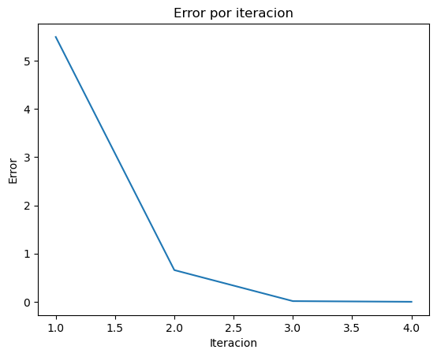

## Import libraries


```python
import sympy as sp
import pandas as pd
import matplotlib.pyplot as plt
```


```python
# Arrays para almacenar los resultados de ambos métodos
results_criticpoint = []
```

## Define functions to use the methods


```python
def funcion_ejemplo(x):
  return (-1.5*(x**6))-(2*(x**4))+(12*x)
```


```python
def raiz(f, x_inicial, max_iter, tol):
  # Definir variable x
  x = sp.Symbol('x')
  # Obtener derivada de la funcion ingresada
  derivative_x = sp.diff(f(x), x)

  x_i = x_inicial
  for i in range(max_iter):
    # Obtain next value
    x_i = x_i - f(x_i)/derivative_x.subs(x, x_i)
    f_xi = f(x_i)
    error = abs(f_xi.evalf())
    results_raiz.append([i+1, x_i.evalf(), f_xi.evalf(), error])
    if abs(f_xi) <= tol:
      return x_i.evalf()

  raise Exception("Max iterations reached")
```


```python
raiz(funcion_ejemplo, 0.8, 100, 0.0001)
```

## Newton method to find local critical point


```python
def minimizar(f, x_inicial, max_iter, tol, array_resultados):
  # Definir variable x
  x = sp.Symbol('x')
  # Obtener derivada y segunda derivada de la funcion ingresada
  derivative_x = sp.diff(f(x), x)
  second_derivative_x = sp.diff(derivative_x, x)
  x_i = x_inicial

  for i in range(max_iter):
    # Obtain next value
    x_i = x_i - derivative_x.subs(x, x_i)/second_derivative_x.subs(x, x_i)
    eval_derivative = derivative_x.subs(x, x_i)
    eval_second_derivative = second_derivative_x.subs(x, x_i)
    error = abs(eval_derivative)
    array_resultados.append([i+1, x_i.evalf(), eval_derivative.evalf(), eval_second_derivative.evalf(), error])
    if abs(eval_derivative) <= tol:
      return x_i.evalf()

  raise Exception("Max iterations reached")
```


```python
minimizar(funcion_ejemplo, 2, 100, 0.0001, results_criticpoint)
```


$\displaystyle 0.91691696764598$


## Plot de resultados


```python
df_criticpoint = pd.DataFrame(results_criticpoint, columns=['Iteracion', 'x_i', 'derivative_xi', 'second_derivative_xi', 'error'])
df_criticpoint
```


<div>
<style scoped>
    .dataframe tbody tr th:only-of-type {
        vertical-align: middle;
    }

    .dataframe tbody tr th {
        vertical-align: top;
    }

    .dataframe thead th {
        text-align: right;
    }
</style>
<table border="1" class="dataframe">
  <thead>
    <tr style="text-align: right;">
      <th></th>
      <th>Iteracion</th>
      <th>x_i</th>
      <th>derivative_xi</th>
      <th>second_derivative_xi</th>
      <th>error</th>
    </tr>
  </thead>
  <tbody>
    <tr>
      <th>0</th>
      <td>1</td>
      <td>1.58333333333333</td>
      <td>-109.312608506944</td>
      <td>-342.981336805556</td>
      <td>109.312608506944</td>
    </tr>
    <tr>
      <th>1</th>
      <td>2</td>
      <td>1.26462034001114</td>
      <td>-33.2897752784348</td>
      <td>-153.476477870447</td>
      <td>33.2897752784348</td>
    </tr>
    <tr>
      <th>2</th>
      <td>3</td>
      <td>1.04771560164117</td>
      <td>-8.56281128227711</td>
      <td>-80.5683181770536</td>
      <td>8.56281128227711</td>
    </tr>
    <tr>
      <th>3</th>
      <td>4</td>
      <td>0.941435472230252</td>
      <td>-1.33088363462640</td>
      <td>-56.6200237064875</td>
      <td>1.33088363462640</td>
    </tr>
    <tr>
      <th>4</th>
      <td>5</td>
      <td>0.917929942781420</td>
      <td>-0.0528477261877205</td>
      <td>-52.1708029533747</td>
      <td>0.0528477261877205</td>
    </tr>
    <tr>
      <th>5</th>
      <td>6</td>
      <td>0.916916967645980</td>
      <td>-9.39466573068870e-5</td>
      <td>-51.9854022898916</td>
      <td>9.39466573068870e-5</td>
    </tr>
  </tbody>
</table>
</div>


El punto mínimo se halla en muy pocas iteraciones, en ciertos casos en la primera iteración ya se encuentra aquel valor


```python
# plot
fig, ax = plt.subplots()

ax.plot(df_criticpoint['Iteracion'], df_criticpoint['error']) # 'Iteracion' en x, 'Error' en y

plt.title("Error por iteracion")
plt.xlabel("Iteracion")
plt.ylabel("Error")
plt.show()
```


    

    


```python

```
