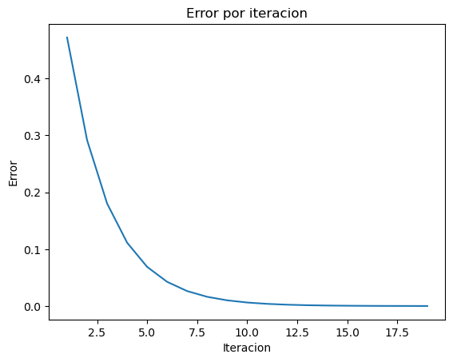

```python
import math
import pandas as pd
import matplotlib.pyplot as plt
```


```python
def funcion_ejemplo(x):
  return -1.5*(x**6)-2*(x**4)+12*x
```


```python
results = []
```


```python
def maximizar(f, x_lower, x_upper, max_iter, tol):

  phi = abs((1 - math.sqrt(5)) / 2)

  for i in range(max_iter):
    a = phi * (x_upper - x_lower)
    x1 = x_lower +  a
    x2 = x_upper - a

    f_x1 = f(x1)
    f_x2 = f(x2)
    error = abs(x2-x1)
    results.append([i+1, x_lower, x_upper, x1, x2, f_x1, f_x2, error])
    if error <= tol:
      return x1
    elif f_x2 > f_x1:
      x_upper = x1
    else:
      x_lower = x2

  return x1
```


```python
maximizar(funcion_ejemplo, 0, 2, 100, 0.0001)
```


    0.9169222533760356


## Plot the results


```python
df_results = pd.DataFrame(results, columns=['Iteracion', 'x_lower', 'x_upper', 'x1', 'x2', 'f_x1', 'f_x2', 'error'])
df_results
```


<div>
<style scoped>
    .dataframe tbody tr th:only-of-type {
        vertical-align: middle;
    }

    .dataframe tbody tr th {
        vertical-align: top;
    }

    .dataframe thead th {
        text-align: right;
    }
</style>
<table border="1" class="dataframe">
  <thead>
    <tr style="text-align: right;">
      <th></th>
      <th>Iteracion</th>
      <th>x_lower</th>
      <th>x_upper</th>
      <th>x1</th>
      <th>x2</th>
      <th>f_x1</th>
      <th>f_x2</th>
      <th>error</th>
    </tr>
  </thead>
  <tbody>
    <tr>
      <th>0</th>
      <td>1</td>
      <td>0.000000</td>
      <td>2.000000</td>
      <td>1.236068</td>
      <td>0.763932</td>
      <td>4.814182</td>
      <td>8.187885</td>
      <td>0.472136</td>
    </tr>
    <tr>
      <th>1</th>
      <td>2</td>
      <td>0.000000</td>
      <td>1.236068</td>
      <td>0.763932</td>
      <td>0.472136</td>
      <td>8.187885</td>
      <td>5.549637</td>
      <td>0.291796</td>
    </tr>
    <tr>
      <th>2</th>
      <td>3</td>
      <td>0.472136</td>
      <td>1.236068</td>
      <td>0.944272</td>
      <td>0.763932</td>
      <td>8.677842</td>
      <td>8.187885</td>
      <td>0.180340</td>
    </tr>
    <tr>
      <th>3</th>
      <td>4</td>
      <td>0.763932</td>
      <td>1.236068</td>
      <td>1.055728</td>
      <td>0.944272</td>
      <td>8.107398</td>
      <td>8.677842</td>
      <td>0.111456</td>
    </tr>
    <tr>
      <th>4</th>
      <td>5</td>
      <td>0.763932</td>
      <td>1.055728</td>
      <td>0.944272</td>
      <td>0.875388</td>
      <td>8.677842</td>
      <td>8.655226</td>
      <td>0.068884</td>
    </tr>
    <tr>
      <th>5</th>
      <td>6</td>
      <td>0.875388</td>
      <td>1.055728</td>
      <td>0.986844</td>
      <td>0.944272</td>
      <td>8.559893</td>
      <td>8.677842</td>
      <td>0.042572</td>
    </tr>
    <tr>
      <th>6</th>
      <td>7</td>
      <td>0.875388</td>
      <td>0.986844</td>
      <td>0.944272</td>
      <td>0.917961</td>
      <td>8.677842</td>
      <td>8.697901</td>
      <td>0.026311</td>
    </tr>
    <tr>
      <th>7</th>
      <td>8</td>
      <td>0.875388</td>
      <td>0.944272</td>
      <td>0.917961</td>
      <td>0.901699</td>
      <td>8.697901</td>
      <td>8.692018</td>
      <td>0.016261</td>
    </tr>
    <tr>
      <th>8</th>
      <td>9</td>
      <td>0.901699</td>
      <td>0.944272</td>
      <td>0.928011</td>
      <td>0.917961</td>
      <td>8.694688</td>
      <td>8.697901</td>
      <td>0.010050</td>
    </tr>
    <tr>
      <th>9</th>
      <td>10</td>
      <td>0.901699</td>
      <td>0.928011</td>
      <td>0.917961</td>
      <td>0.911749</td>
      <td>8.697901</td>
      <td>8.697240</td>
      <td>0.006211</td>
    </tr>
    <tr>
      <th>10</th>
      <td>11</td>
      <td>0.911749</td>
      <td>0.928011</td>
      <td>0.921799</td>
      <td>0.917961</td>
      <td>8.697306</td>
      <td>8.697901</td>
      <td>0.003839</td>
    </tr>
    <tr>
      <th>11</th>
      <td>12</td>
      <td>0.911749</td>
      <td>0.921799</td>
      <td>0.917961</td>
      <td>0.915588</td>
      <td>8.697901</td>
      <td>8.697884</td>
      <td>0.002372</td>
    </tr>
    <tr>
      <th>12</th>
      <td>13</td>
      <td>0.915588</td>
      <td>0.921799</td>
      <td>0.919427</td>
      <td>0.917961</td>
      <td>8.697765</td>
      <td>8.697901</td>
      <td>0.001466</td>
    </tr>
    <tr>
      <th>13</th>
      <td>14</td>
      <td>0.915588</td>
      <td>0.919427</td>
      <td>0.917961</td>
      <td>0.917054</td>
      <td>8.697901</td>
      <td>8.697929</td>
      <td>0.000906</td>
    </tr>
    <tr>
      <th>14</th>
      <td>15</td>
      <td>0.915588</td>
      <td>0.917961</td>
      <td>0.917054</td>
      <td>0.916494</td>
      <td>8.697929</td>
      <td>8.697925</td>
      <td>0.000560</td>
    </tr>
    <tr>
      <th>15</th>
      <td>16</td>
      <td>0.916494</td>
      <td>0.917961</td>
      <td>0.917401</td>
      <td>0.917054</td>
      <td>8.697924</td>
      <td>8.697929</td>
      <td>0.000346</td>
    </tr>
    <tr>
      <th>16</th>
      <td>17</td>
      <td>0.916494</td>
      <td>0.917401</td>
      <td>0.917054</td>
      <td>0.916841</td>
      <td>8.697929</td>
      <td>8.697930</td>
      <td>0.000214</td>
    </tr>
    <tr>
      <th>17</th>
      <td>18</td>
      <td>0.916494</td>
      <td>0.917054</td>
      <td>0.916841</td>
      <td>0.916708</td>
      <td>8.697930</td>
      <td>8.697929</td>
      <td>0.000132</td>
    </tr>
    <tr>
      <th>18</th>
      <td>19</td>
      <td>0.916708</td>
      <td>0.917054</td>
      <td>0.916922</td>
      <td>0.916841</td>
      <td>8.697930</td>
      <td>8.697930</td>
      <td>0.000082</td>
    </tr>
  </tbody>
</table>
</div>


```python
# plot
fig, ax = plt.subplots()

ax.plot(df_results['Iteracion'], df_results['error']) # 'Iteracion' en x, 'Error' en y

plt.title("Error por iteracion")
plt.xlabel("Iteracion")
plt.ylabel("Error")
plt.show()
```


    

    


```python

```


```python

```
